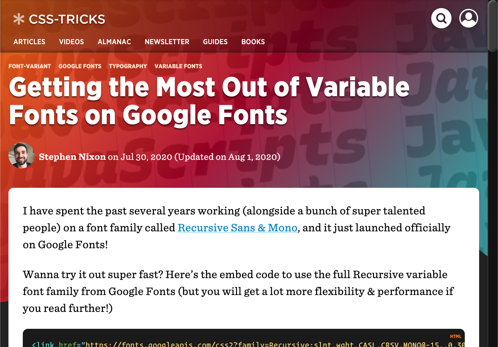

I’ve been following **CSS-Tricks** for many years, so I am very excited to have finally written an article for publication on the site.

TL;DR: You can do a lot more with Google Fonts URLs than you might think, especially if you’re calling in a variable font like Recursive. This article explains what is possible and shows how to craft custom Google Fonts API calls (which is a lot less scary than it sounds).

[css-tricks.com/getting-the-most-out-of-variable-fonts-on-google-fonts/](https://css-tricks.com/getting-the-most-out-of-variable-fonts-on-google-fonts/)