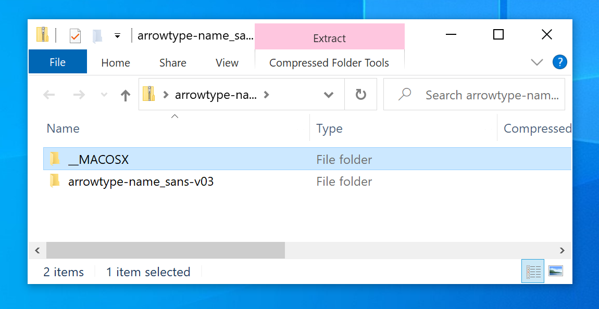
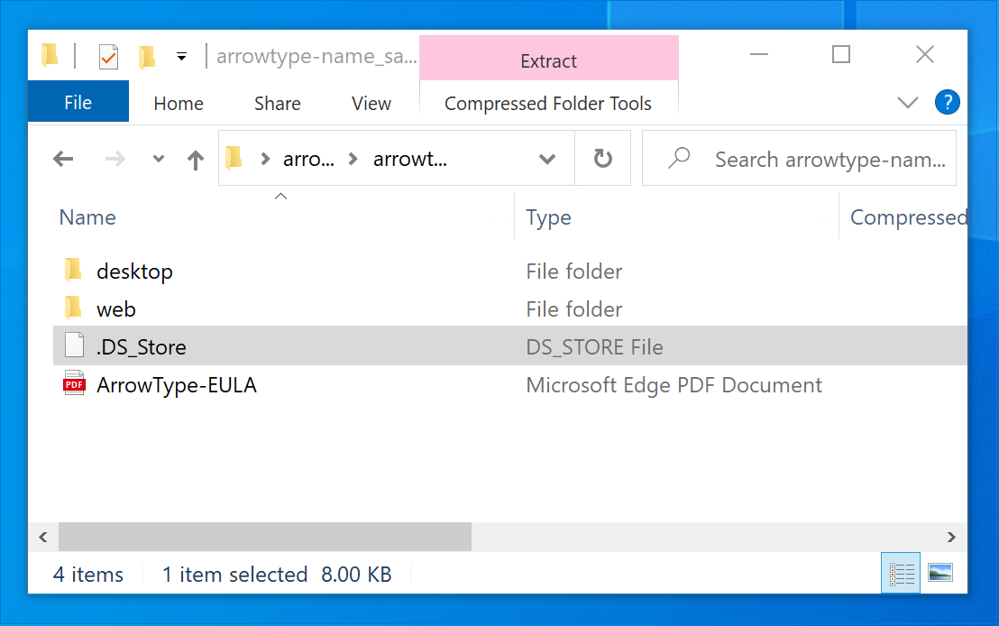

Making zip files from folders is a very common and very handy thing to do – so often, sending someone one file beats sending a whole collection of files! But, if you’re only ever making zips on a Mac, you may not realize that you’re also zipping up a few metadata files, and that these might confuse (or at least annoy) folks on other operating systems.
## The Problem

I only learned this recently: if you are on a Mac and make a zip of a folder in a regular way (e.g. by right-clicking a folder, then selecting ‘compress’, or with a basic usage of the `zip` command-line utility), it includes obnoxious, unnecessary files for folks that decompress those zips on Windows computers.

1. The top level will have an empty `_MACOSX` folder
2. Every other level will have a `.DS_Store` file





The `_MACOSX` folder is often empty, and multiple sources point to it being a [resource fork](https://en.wikipedia.org/wiki/Resource_fork), without really saying why it ends up in zips. (If someone knowledgable would like to explain this to me, feel free!) For the purposes of this post, it is also unnecessary to say what it is or why it ends up in zips, other than that it does, but that it doesn’t need to be there.

The [.DS_Store](https://en.wikipedia.org/wiki/.DS_Store) saves your preferences for file viewing in Finder, such as the placement of files in the “icon” view or the sorting in the “list” view. However, these generally aren’t very helpful in zipped folders, and if you send these zips to Windows users, they are especially unhelpful.

## A command-line solution

To avoid this, you can compress a folder on the command line. Use `cd` to navigate to its parent directory, then use this command (replacing arrowtype-name_sans-v03 with the appropriate folder name):

```bash
zip arrowtype-name_sans-v03.zip -r 'arrowtype-name_sans-v03' -x '*/.DS_Store'
```

This command is somewhat unintuitive and may not work as expected if you change or leave out the single quotes. The best way to be sure it worked as you expect is to try opening it in Windows (whether on an actual PC or via a virtual machine using software like VMWare or Parallels). 

One good way to avoid remembering this or worrying about syntax is by automating it with a shell function in your shell profile.

### Automating it with a function

The function below will make a clean zip if you call if with a path, like `zipit path/to/folder`.

```bash
function zipit {
  currentDir=$(pwd)                             # get current dir so you can return later
  cd $(dirname $1)                              # change to target’s dir (works better for zip)
  target=$(basename $1)                         # get target’s name
  zip -r $target.zip $target -x '*/.DS_Store'   # make a zip of the target, excluding macOS metadata
  echo "zip made of " $1                        # announce completion
  cd $currentDir                                # return to where you were
}
```

It may seem a little bit complicated, but due to the way `zip` works, it is best to change to a target’s folder before zipping it.

Of course, it is worth making sure the terminal has this function in memory for it to work, so you should store this in your `.bash_profile` file (or `.bashrc`, [depending on your approach](https://scriptingosx.com/2017/04/about-bash_profile-and-bashrc-on-macos/)). Then, you can call it from any terminal session.

## The Result

When you exclude the `.DS_Store` files, it avoids both problems, and the result is much cleaner:


## An easier solution

I mentioned this article in a [Twitter thread](https://twitter.com/ArrowType/status/1298375103152107520), and several people mentioned the approaches they take to this problem.

A notable easy solution is [Keka](https://apps.apple.com/us/app/keka/id470158793?mt=12), which is a native Mac app which can make clean zips, password-protected zips, and more. So, if you have $2.99 and you want a solution available via right-click or drag-and-drop, this is probably worth it.

Of course, if you are already using a shell script to set up a build, the function may be the simplest & most efficient way to do this. Or, if you are using a Python-based build flow, that also [got a reply](https://twitter.com/mass_driver_tm/status/1298377561869819905?s=20) in the thread.

Happy zipping!
