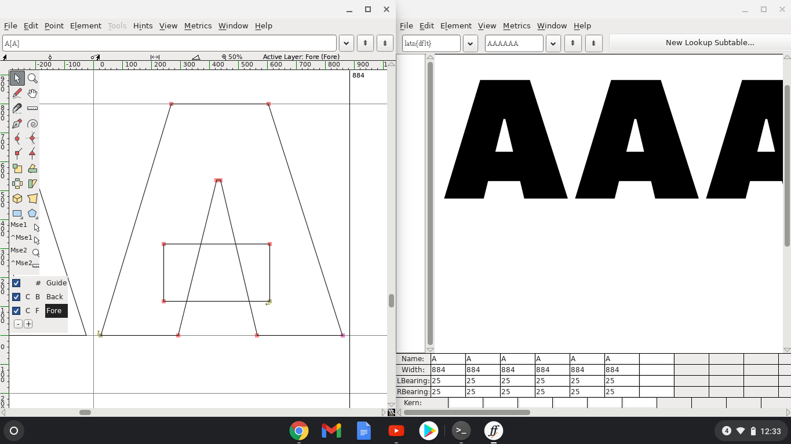

You might think you have to spend a lot of money on a power Mac computer & software like Glyphs or RoboFont to get started in type design. While these things are very nice, it’s not actually a requirement. You can instead get a Chromebook for about $150 to $250, then use open-source software like FontForge.

## Set up Linux (beta)

Not all Chromebooks will be able to run Linux out of the box, so check out the [supported devices](https://sites.google.com/a/chromium.org/dev/chromium-os/chrome-os-systems-supporting-linux) before buying a Chromebook, if this is a thing you are seriously considering doing.

To quote the official [ChromeOS Linux instructions](https://support.google.com/chromebook/answer/9145439?hl=en), here’s how to install Linux on a Chromebook:

1. At the bottom right, select the time.
2. Select **Settings**.
3. Under "Linux (Beta)," select **Turn On**.
4. Follow the steps on the screen. Setup can take 10 minutes or more.
5. A terminal window opens. You have a Debian 10 (Buster) environment. You can run Linux commands, install more tools using the APT package manager, and customize your shell.

## Install Flatpak

Note: to copy on a Chromebook, use Control+C. To paste in the terminal, you must use Control+V, *then* right click on the terminal.

First, follow the instructions to [install Flatpak on ChromeOS](https://flatpak.org/setup/Chrome%20OS/).

Note: for step 4 of the instructions above, you will probably have to add `sudo` to make it work:

    sudo flatpak remote-add --if-not-exists flathub https://flathub.org/repo/flathub.flatpakrepo

## Install FontForge

Then, install [FontForge](https://flathub.org/apps/details/org.fontforge.FontForge):

    sudo flatpak install flathub org.fontforge.FontForge

Note: If you run without the `sudo`, you might get an error like this:

    stephen@penguin:~$ flatpak run org.fontforge.FontForge
    error: app/org.fontforge.FontForge/x86_64/master not installed

## Off to the races!

For tips & resources on getting started in type design generally, check out my blog post [**Getting started in Type Design (and possible next steps)**](https://arrowtype.github.io/type-blog/2020-05-01--getting-started-in-type/). This advice does skew towards Mac & RoboFont (my main setup), but it also includes some good information that is about type design & development not tied to any particular OS or software.

For guidance specific to using FontForge, check out [fontforge.org/docs/tutorial.html](https://fontforge.org/docs/tutorial.html) and [Designing with FontForge](http://designwithfontforge.com/en-US/index.html).
