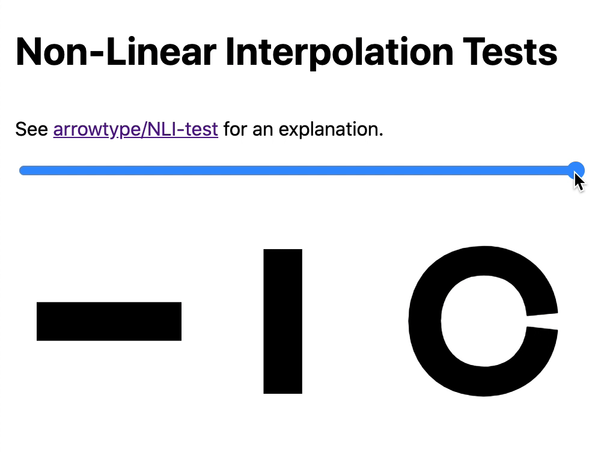

Ever since [Underware Type started exploring what they call HOI (Higher-Order Interpolation)](https://underware.nl/case-studies/hoi/), I’ve been amazed by the creative possibilities of this approach to interpolation, and I’ve wanted to try it myself.

For a long time, I didn’t get it. Then, I started to understand it, but felt like actually making it work would be nearly impossible (or super inefficient, at best). But, I’ve taken another look and got a functional test working, so I’ve documented & shared my findings. I *still* feel like it would be nearly impossible to use in designing full typefaces. So I am doubly impressed that Underware has made it work, and hope that Underware will succeed in licensing their internal tools to allow others to put HOI into practice as well.

→ Full post at [github.com/arrowtype/NLI-test](https://github.com/arrowtype/NLI-test/)

→ Web demo of [NLI in variable TTFs](https://arrowtype.github.io/NLI-test/)

