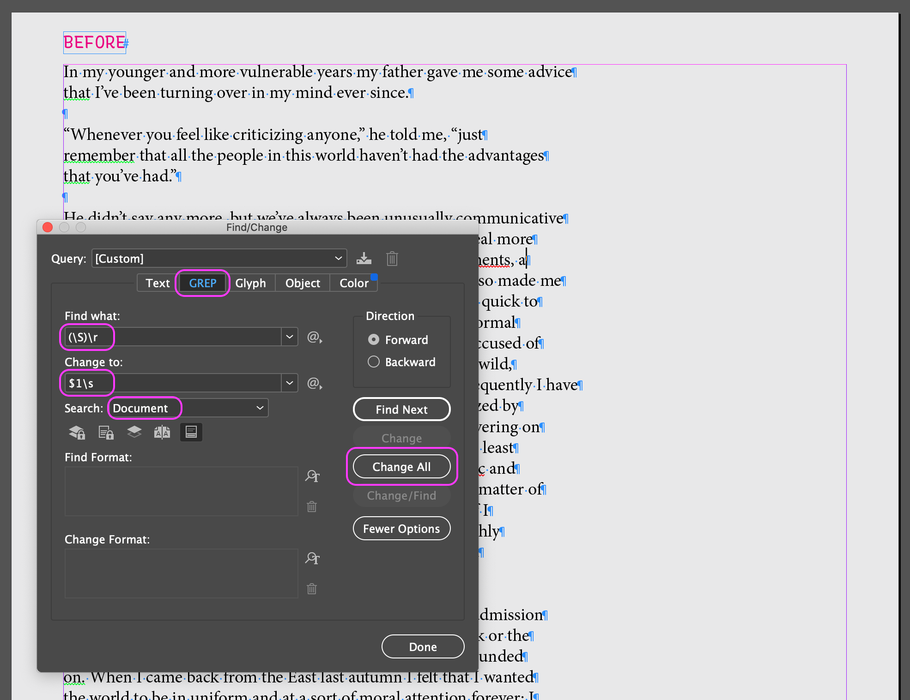
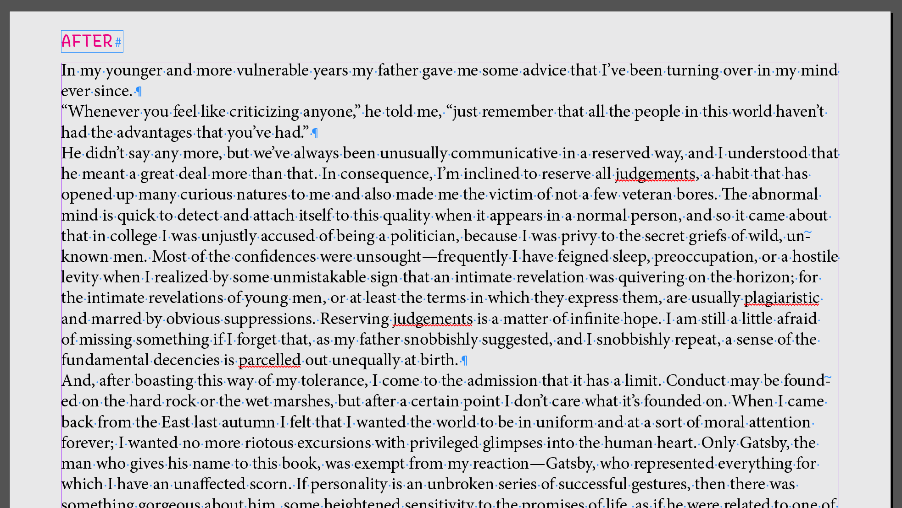

Let’s say you want to take a public domain book and flow it into an InDesign document, in order to make a book. Part of this process is converting the plain-text formatting into something you can use in an InDesign workflow. There are various ways you could approach this, but one tool is the Find/Change function within InDesign itself – and in particular, GREP. I can’t cover all of the possibilities of GREP in this post, but I can introduce one aspect of it. If you can get this aspect, you might be able to extend that into a more “programatic” way of thinking about handling design documents, and that can be a very powerful (and fun) way to think about design!

## The Problem

Say you want to layout a [a public-domain book from Project Gutenberg](https://www.gutenberg.org/ebooks/64317). You can start with the “Plain Text UTF-8” format. However, this will likely have many forced line breaks to maintain a reasonable column width in plain text (otherwise, each paragraph would appear as one long line).

The helpful thing is that paragraphs are separated by *two* line breaks. We can use this pattern to easily format this text for a book layout, in InDesign.

## How to handle this in InDesign

Use GREP in the Find/Change panel! 

Go to **Edit > Find/Change** (Command F), then click into the **GREP** tab.

Find the following:

**`(\S)\r`**

This finds all instances of **`\S`** (any character that is *not* a white space), followed by **`\r`** (a *return* character). This is a way to use code to find what is happening in these paragraphs with forced line breaks. Putting the any-character wildcard in parentheses, **`(\S)`**, saves whatever is found for the next step.

Change this to:

**`$1\s`**

The **`$1`** places back that character we just saved, then follows it with `\s` (a space character in InDesign’s **Change to** field).

Make sure that you have **Search** set to **Document**, then click **Change All**. You should set that a bunch of replacements were made.

Now, we have a set of paragraphs that can be flowed into the pages of a book!

The thing that makes this work is that the text used double returns in between paragraphs. If a return followed any character other than a return, it was changed into a space. In a GREP way of thinking, that was exactly what we needed!

## Notes

Three extra things:

1. If you look closely, you might have a lot of instances of paragraphs ending with a *space* just before the return. If you don’t want this, do a second GREP pass to find **`\s\r`** and replace it with just **`\r`** by itself.
2. Adobe provides a helpful list of [metacharacters for searching in Find/Change](https://helpx.adobe.com/incopy/using/find-change.html#metacharacters_for_searching), and this is worth a look when you need to make future Find/Change replacements.
3. In the Find/Change panel, you can also find and/or set character styles – for instance, you could apply a small-caps style to all instances of a word like `NASA`. I didn’t know this for a long time, but it’s a very handy feature!
