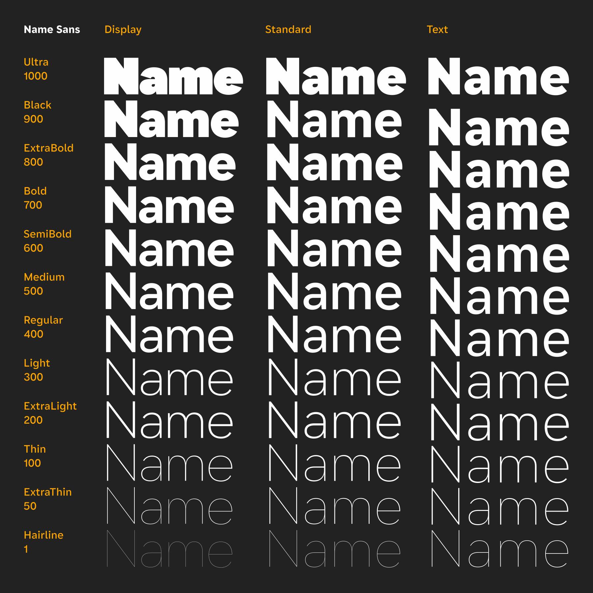

[Name Sans](https://name.arrowtype.com) is a modern interpretation of the mosaic name tablets of the NYC Subway. It is currently available with discounted pre-release pricing [via Future Fonts](https://www.futurefonts.xyz/arrowtype/name-sans). 

Name Sans is now in its fifth pre-release version – `0.5` – so I wanted to take a moment to reflect on what the family is, how it has evolved since v0.1, and where it’s headed in the future. My favorite typefaces are always released along with an introductory article. In a way, you can think of this as the “v0.5” blog post introducing Name Sans, its process, and its design.

## What is Name Sans, anyway?

It isn’t always (if ever?) obvious what a project should be from the outset. Releasing Name Sans progressively through Future Fonts has helped me to search for what it really should be as a typeface. Certainly, my understanding of it has evolved since the earliest versions, and seeing it in use by other designers has helped push my thinking forward.

So what is Name Sans?

Well, one simple answer is that it’s the font you’re reading right now – but it’s also much more than that. Another simple answer is that it’s a 36-style font family with variable axes for Weight and Optical Sizing. But it’s also more than **that.**

As the tag line says, Name Sans is *a modern interpretation of the mosaic name tablets of the NYC Subway.* It’s a project I have been imagining and sketching since moving to NYC in 2014 and becoming a daily commuter on the NYC Subway – though I was only really been able to dive into it around the end of 2019.

When I first had the idea for this project as a new commuter in NYC about 5 years ago, I expected that I could dig up some kind of perfect blueprint for the signage, and work from that to make a revival. I have since seen a few tantalizing examples that are *close* to what I’d hope for, but finding a direct plan is much less simple than I initially thought it might be. So, instead, the drawings for Name Sans are not a direct copy of scans from a dusty old type specimen, but rather the product of me experiencing and appreciating the Subway mosaics over time, taking countless photos and sketching ideas based on them while riding the train.

At one point, early on, I mentioned to an experienced type designer that I was thinking of making a typeface that would be a revival of the Subway mosaics. “Impossible!” they said, “what would you even revive?” At first I was taken aback and thought I could prove them wrong, but with time, I have understood what they meant.

Name Sans is not a *revival*, and it isn’t intended to be. There was no single, consistent “off-the-shelf” font used for the Subway mosaics. The system was built by [several separate companies over many decades](https://en.wikipedia.org/wiki/New_York_City_Subway#History), with projects led by several different architects and carried out by different construction crews. Type revivals are recreations of fonts that were previously made with a different technology, like when a digital font is made to recreate the shape of letters originally cast in lead for letterpress printing. The subway mosaics are a loose system of architectural lettering – not a singular typeface which one could “revive.”

So, this project is perhaps as much historical fiction as it is historical research. I am creating a type family based on what I have observed in actual mosaics, but also adapting this to what I think is useful and compelling for a typeface in the current decade (and hopefully beyond, but let’s not get too far ahead of ourselves).

In many ways, not having a single point of reference is exactly what has freed me to make this project what it needs to be: a typeface that respects the past but doesn’t get stuck in it. While there are clearly repeated lettering styles for different lines and different eras, something I love about the Subway is that there is *not* a perfectly-repeated system for the name tablets. If it was all just Helvetica and stations had a perfectly-repeated aesthetic, the Subway would be boring. (More practically, it would also simply be harder to know when you reached the right station. As a rider of the NYC Subway, you learn to identify stops by the color of tiles and the big lettering on the station walls. If you always had to look closely for Helvetica on uniformly–colored walls, you would end up missing stops a lot more often.)

Name Sans picks up on my favorite aspects of the Subway wayfinding system and brings them together into an extended Latin character set with wide range of weights and optical sizes. If I had gotten stuck on finding just *one* thing to revive, I wouldn’t have had the flexibility to really explore what is useful in a geometric-grotesque sans – and what is newly possible with type technology today.

For starters, the mosaics only contain the basic English uppercase alphabet, plus numbers and a few extra symbols like arrows and ampersands. I was always going to have to invent the lowercase, extended Latin alphabet, accents, and symbol set. But beyond that, the mosaics only have a narrow range of weights – roughly “Regular” to “SemiBold” – and only have a sign-specific range of sizes – large to huge, though typically seen from a distance. In my mind, any truly-useful modern typeface should offer a wider typographic palette to its users. Additionally, type is most versatile if it’s designed for the scales and contexts we tend to engage with type at on screens and in print, most often in longer strings than single Subway station names.

Working from more than a single blueprint has also revealed possibilities beyond size & weight ranges. Rather than picking only the most common style of a uppercase, I have made two – a default set that looks pretty much how you’d expect a geometric sans to look, plus a stylistic set (`ss01`) that takes on the flat-sided, rectangular shaping of the mosaics used in many of the stations outside of Manhattan. A difficult part has been deciding which `R` to borrow from the system – the more common, basic construction with a straight leg, or the intrinsically-mosaic approach to a grotesque `R` with a leg “kick”? Well, it’s a modern typeface, so I could include both! And then, it’s a modern typeface, so why not add a few other things fit for modern expectations, like a single-story `a`?

And thus, I have sought to make a typeface that captures the best energy and spirit of the Subway mosaics, but which is genuinely useful to designers working in digital systems and graphic design. I hope that Name Sans may also get used in wayfinding (and certain decisions have been made to enable this), but it is designed first and foremost for the place I encounter typography the most: the Web.

(Sidenote: if any transit archivists or superfans are reading this and know of specific blueprints or specifications that I might have missed, I’d be super appreciative to learn more or to be proven wrong! The [online archives](https://nytm.pastperfectonline.com/) are great, but understandably don’t contain images for every possible item. A [2019 exhibit](https://www.nytransitmuseum.org/program/changing-signs-changing-times-a-history-of-wayfinding-in-transit/eakhu-fxuaigwz_/) did include a few wonderful watercolors and pencil sketches, but not as many as I had hoped for. I haven’t yet been able to dig further into physical archives due to COVID-19 protocols, but I would very much like to see more!)

## A wide range of Weights & Optical Sizing

<!-- SVG to allow css variable -->
<svg class="main-col" xmlns="http://www.w3.org/2000/svg" viewBox="0 0 1839 1761">
  <g fill="none" fill-rule="evenodd" transform="translate(35.177 .155)">
    <path fill="hsla(0deg, 0%, 60%,50%)" d="M537.676646,1752.66536 C773.612368,1752.66536 922.877825,1686.86016 1022.38813,1548.82974 L1035.22817,1548.82974 L1075.35329,1728.59029 L1768.71541,1728.59029 L1768.71541,831.392545 C1768.71541,272.850835 1470.1845,-6.82121026e-13 911.64279,-6.82121026e-13 C487.921493,-6.82121026e-13 186.18057,194.205594 56.1751719,515.206577 L706.202162,717.437196 C731.88224,650.02699 775.217373,611.506872 849.047599,611.506872 C927.692839,611.506872 974.237982,659.657019 974.237982,743.117275 L974.237982,754.352309 L617.926891,754.352309 C215.070658,754.352309 -7.95807864e-13,953.372918 -7.95807864e-13,1259.92886 C-7.95807864e-13,1563.27478 218.280668,1752.66536 537.676646,1752.66536 Z M861.887638,1240.6688 C797.687442,1240.6688 768.797353,1208.5687 768.797353,1158.81355 C768.797353,1110.6634 805.712466,1076.9583 861.887638,1076.9583 L974.237982,1076.9583 L974.237982,1115.47841 C974.237982,1200.54367 930.902849,1240.6688 861.887638,1240.6688 Z" opacity=".26"/>
    <path stroke="#9F9F9F" stroke-width="2" d="M899.993496,45.9401376 C1136.77279,45.9401376 1314.89071,110.454114 1434.49056,231.655746 C1555.73202,354.520973 1616.80798,535.602773 1618.01737,766.597265 L1618.0357,773.612368 L1618.0357,1727.59029 L1236.30682,1727.59029 L1205.81172,1514.12464 L1191.54526,1514.12464 C1089.02726,1681.09697 920.658411,1754.87537 691.342857,1754.87537 C519.119491,1754.87537 379.017056,1704.91248 281.726274,1616.76869 C183.539528,1527.81318 128.986133,1399.98208 128.986133,1245.48381 C128.986133,1089.16222 185.312866,961.203038 288.632577,872.643286 C389.716812,785.999655 535.745472,737.076743 717.911714,736.106949 L723.442955,736.09225 L1154.58427,736.09225 L1154.58427,690.152112 C1154.58427,614.000026 1130.83909,552.429781 1084.48309,510.262576 C1039.61807,469.451623 973.535397,446.796371 887.153456,446.796371 C740.982203,446.796371 637.162903,512.679198 558.670127,621.237838 L556.299293,624.540533 L227.293676,380.181992 C379.598248,177.046019 611.816289,45.9401376 899.993496,45.9401376 Z M1154.58427,1061.51325 L786.038147,1061.51325 L784.097692,1061.51767 C720.208548,1061.80936 670.76377,1076.52845 637.067249,1103.48567 C602.466347,1131.16639 584.412533,1171.7544 584.412533,1223.01374 C584.412533,1275.6828 602.325326,1316.95085 636.449567,1345.02079 C670.294695,1372.86114 720.142032,1387.72424 784.433142,1387.72424 C895.503196,1387.72424 988.038854,1355.89213 1052.80161,1300.13984 C1117.5649,1244.3871 1154.58427,1164.70929 1154.58427,1068.93327 L1154.58427,1068.93327 L1154.58427,1061.51325 Z"/>
    <path stroke="#9F9F9F" stroke-width="2" d="M921.979168,88.7991389 C1132.62168,88.7991389 1295.46021,150.81943 1405.92995,266.691109 C1516.50136,382.66943 1574.58464,552.560861 1575.73525,768.047086 L1575.75268,774.59092 L1575.75268,1727.73521 L1358.37175,1727.73521 L1342.36262,1449.17631 L1332.8021,1449.17631 C1280.81478,1550.94678 1207.71793,1628.70637 1109.70624,1680.54726 C1014.96693,1730.65731 896.963648,1756.55165 752.282364,1756.55165 C579.900293,1756.55165 440.177005,1709.95962 343.4906,1626.25682 C246.597963,1542.37547 192.96273,1421.23266 192.96273,1272.47494 C192.96273,1121.03509 249.212979,998.520489 352.483444,914.026473 C454.136187,830.856047 601.303802,784.527654 785.1228,783.609403 L790.704282,783.595486 L1312.00109,783.595486 L1312.00109,737.769915 C1312.00109,610.526259 1275.99543,508.766022 1208.93112,438.941868 C1142.34439,369.614943 1045.11861,331.738865 921.979168,331.738865 C739.719541,331.738865 612.257421,410.021385 511.759691,549.599997 L508.72253,553.848396 L310.191308,404.552917 C450.877126,197.22827 660.119448,88.7991389 921.979168,88.7991389 Z M1312.00109,996.11786 L811.516154,996.11786 L808.076107,996.12525 C694.802512,996.612819 606.088765,1021.21534 545.351422,1066.026 C483.227813,1111.85942 450.310675,1178.82875 450.310675,1262.86946 C450.310675,1349.51675 483.167479,1418.12972 543.640327,1465.13361 C604.2266,1512.22567 692.586986,1537.62562 803.511588,1537.62562 C958.287005,1537.62562 1085.38011,1490.68618 1173.79367,1407.29295 C1262.23751,1323.87116 1312.00109,1203.95604 1312.00109,1057.95256 L1312.00109,1057.95256 L1312.00109,996.11786 Z"/>
    <path fill="var(--namesans-accent)" d="M815.372225,1760.69039 C1203.78341,1760.69039 1462.18921,1521.54466 1491.07929,1134.73847 L1491.07929,1728.59029 L1494.2893,1728.59029 L1494.2893,762.377333 C1494.2893,367.546125 1284.03366,134.820413 926.117564,134.820413 C686.971832,134.820413 495.976248,231.120707 372.39087,436.561336 L375.600879,438.166341 C499.186258,234.330717 688.576837,138.030422 926.117564,138.030422 C1282.42865,138.030422 1491.07929,369.15113 1491.07929,762.377333 L1491.07929,839.417569 L841.052304,839.417569 C459.061135,839.417569 240.780467,1003.12807 240.780467,1288.81894 C240.780467,1584.13985 457.45613,1760.69039 815.372225,1760.69039 Z M815.372225,1757.48038 C459.061135,1757.48038 243.990477,1580.92984 243.990477,1288.81894 C243.990477,1006.33808 460.66614,842.627579 841.052304,842.627579 L1491.07929,842.627579 L1491.07929,1056.09323 C1491.07929,1484.62954 1229.46349,1757.48038 815.372225,1757.48038 Z"/>
  </g>
</svg>

To understand Name Sans, it is essential to first have an idea of what **optical sizing** is.

- [ ] write this

- [ ] Standard has proportions and letter spacing similar to other common sans-serif fonts, so if you don’t want to mess with optical sizes, you can just use this one

- [ ] Display calls back to super tight-fitting helvetica, as used ... when? It has stricter geometry and more monolinear strokes to look dramatic at large sizes.

- [ ] Text has more-generous letter spacing, more-compact proportions, and exagerated details in order to optimize rhythm and readability at smaller sizes, while keeping the personality of the family intact.
## Geometry, but with nuance

A striking, obvious trait of the mosaics is that the circular letters get to be *circles.* In type, a circle never really looks like a circle, but I’ve iterated a lot to get as close as possible to a circular basis for letters like `O C G Q o c` – and keep things looking circular, in the context of type.

“Keeping things circular” may sound like an extremely easy task. Just draw some circles, right? Actually, it’s not that simple. In well-made type, seemingly-circular letters are never actually just circles. Generally, the letter `O` has to be just a little less wide than tall, and its sides have to be a little thicker than its top and bottom. Further complicating things, letters like `C` and `G` can’t just copy the curvature of the `O`, or they will look comparatively wide. You can start to see these differences if you start rotating fonts and looking at them sideways. This is true even in the classics like Futura that designers may tend to think of as “purely geometric”.

Of course, geometric type is not meant to **be** geometric – it’s meant to **look** geometric, in actual use. The way that is achieved will vary from project to project, and like any creative project, the specifics solutions will depend on the creator.

If you try to draw a font and don’t compensate for optical issues, it will look bad. Circles will look diamond-shaped, horizontal strokes will appear to be too thick, and places where strokes merge will look overly-thick. Correcting for the issues caused by how our eyes perceive type is called *optical compensation*. It’s an area of type design that is not always intuitive at first, but something which is essential to learn and engage with when making type.

I could show how you might adapt the above example into a better font with a few optical corrections ... but this post isn’t really about that. The point is, once you know the problems to avoid, you can start to evaluate fonts by how they individually solve those problems. There are lots of good geometric sans-serif fonts in the world; Name Sans is my entry into the field. Of course, I am not *just* trying to make the most-geometric-possible font with Name Sans. Rather, I have sought to achieve geometry where it works, but also make a font that is a little more versatile, bringing in elements of “grotesque” fonts where they can improve goals like visual consistency and readability. I doubt it is possible to determine precisely the design goals of the designers of the original Subway mosaics, but my speculation is that they had similar goals: make letters that were geometric, but also natural.

Some fonts prioritize strict geometric shaping more strictly than others, and that can work. But, such typefaces are accepting a trade-off. If a font cares more about strict geometry than other goals like optical consistency, they will inevitably take on a decorative aesthetic.

One important decision that has to be made along these lines: whether letters like `b d p q` are drawn to be circular, or given a bit of optical compensation. I find that if the `b d p q` are drawn with bowls that are too circular, a typeface can look cool, but sacrifices versatility. It will always look a little too art-deco or disco to be used for serious communication. Even though I love typefaces like [Avant Garde](https://en.wikipedia.org/wiki/ITC_Avant_Garde) and and many of the projects inspired by it, it basically always communicates some blend of nostalgia and whimsy. This is fine, but not useful for every project.

Therefore, I have drawn letters like `b d p q` to match the visual average width of `n` and `o`, rather than to look circular. This, in turn, helps to establish a visual rhythm that doesn’t call too much attention to itself.

Even though I want to capture the charm of the Subway mosaics, charm is not only achieved through decoration. Instead, I seek to create something which balances geometry and nuance. I want to create something that can offer genuine utility in a wide range of applications. So, in Name Sans, the not-quite-circularity is just as critical as the circularity.

## Sharpness

A subtlety I love about the Subway mosaics is that diagonal vertices often don’t simply have a one-stroke width, as you might achieve if you were trying to make a purely “elemental” letterform. Instead, they almost always add a bit of sharpness, making vertices to something closer to about 2/3 stroke thickness. This gives vertices more sharpness, visually suggesting that diagonal letters are made in a single motion, rather than from separate strokes.

Most sans-serifs that easily come to mind take one extreme or the other on their treatment of vertices. Broadly speaking, they either take the *Futura* route with razor-sharp points, or else the *Helvetica* route of prioritizing evenness of strokes, proportions, and color and not really considering vertices as a thing to preserve. I like that the mosaics take a practical approach that is a little bit sharp, but in a subtle way that doesn’t call attention to itself, and I have sought to preserve this in all but the very thickest weights of Name Sans.

It comes from a slightly different logical basis that many sans-serifs. Rather than suggesting diagonal letters are made from separate diagonal strokes and attempting to perfectly balance the interior spaces – as a signpainter might create them – these paths are suggestive of the way a person with a pencil might write such characters with zig-zags. They prize a repeated interior volumes a little less, and show the letters as “single units” a little more.

I have extended this quality of sharpness to the meeting points (AKA “crotches”) of lowercase letters like `n m b d g p q`. Rather than trying to suggest a single, monolinear vertical stem on these letters, I have borrowed the idea of sharpness to give a little more whitespace to these corners, while also avoiding needed to overly pinch the strokes connecting bowls. Would the original architects have done it this way? It’s hard to say – possibly not. But, this move allows the typeface to work together in a way that maintains a sense of sharpness, while also remaining a cohesive sense of each letter being a self-contained little entity that works smoothly with its neighbors.

Like every aspect of Name Sans, this approach to sharpness is adapted across optical sizes to be ideal at large, medium, and small sizes. As the `opsz` decreases, the stem sharpness is dialed up to preserve this visual feature.

It’s hard to put into academic terms, but this slight sharpening of stems also gives me a certain **feeling** of the sharp edges and slight imperfections of the ceramic tiles used in mosaics – even when (or especially when) it’s used for text.

## Optical compensations both exagerated and (almost) ignored

There is so much that could be included to when describing the personality of the Subway mosaics – and so many divergent examples that could be highlighted. I suspect that any given type designer might pick up on something different.

- [ ] add image of 96th st

For me, though, a core of the personality is the way the signage handles optical compensation, beyond just how circles look.

In almost every widely-used typeface, optical compensations tend to follow a predictable pattern (at least once you know what to look for). Horizontal strokes are a little thinner than vertical strokes. Joins get narrow to avoid looking too thick. The bottom “halves” of certain letters are a little bigger than the tops. As mentioned above, “circles” are never really circles. There are these and many, many more tricks that you discover while drawing type.

Meanwhile, the mosaic letters often either completely exaggerate or completely disregard the rules of optical compensation. For one, the tiles don’t tend to modulate thickness between vertical and horizontal strokes, because they are (more or less) square. But also, the `S` tends to exaggerate its form by being much wider on the bottom than at the top, while the `B` will contrast this with two bowls that completely match in size. The `E` has a middle bar that is super-short, while the `5` forgoes a typical slanted top-left.

These quirks are some of what make the mosaics so endearing to me. In the context of mosaics, the lettering can get away with a lot of liberties that would look bad elsewhere.

In Name Sans, I’ve had to moderate some of the extreme quirks of the mosaics to make sense in a digital typeface. But, I’ve kept a taper in the `S`, I’ve kept vertical and horizontal strokes as nearly-monolinear as they could be, I’ve kept the `B` nearly vertically-symmetrical, I’ve kept a short mid bar on the `E`, and I’ve kept an upright `5`. I’ve kept certain whitespaces, like that of the `n`, exactly symmetrical (except in the lightest styles, where this starts to look bad). For every quirk in Name Sans, there are mosaic letters that led me to make that decision.

As an extra note, the Subway mosaics can get away flaunting optical compensation to such a degree in part because they are large, and because they never really have that much text. In making Name Sans, I have found that the larger optical sizes can come closer to matching that stubborn approach, while smaller optical sizes work best if they introduce progressively more optical compensation. 

Letters which look circular at a large scale look overly-wide in smaller, longer texts. It might be that our eyes are just used to reading certain fonts, and it may be an effect of our eyes rapidly moving horizontally when we read. Either way, anything close to an actual circle will look oblong in running text, so Name Sans accounts for this. Display styles emphasize geometry at a large scale while Standard & Text styles attempt to look geometric-but-not-distractingly-so.

Similarly, many of the optical conventions bucked by Name Sans Display are normalized a little bit in smaller optical sizes: the `S` and `B` become a bit more traditionally balanced, strokes gain a little bit more contrast, the `5` gets a bit of a slant, and so on. This makes Text sizes a little more familiar to read, while still keeping things lively.

## Blending Rigidity & Fluidity

Often times, the most striking feature of the Subway mosaics is how they seem to defy the physics you might expect of rectangular tiles. The way that letters will gracefully, fluidly curve sometimes seems like the makers were just showing off. (This is even more striking in the serif styles of lettering, but that is a topic for another project.)

But also, there are plenty of moments where the grid of tiles is embraced and where the rectangularity of tiles is allowed to guide the stroke they create. Flat-sided round letters are an obvious example of this. In a broader sense, the strict use of uppercase-only letters is another example of this – uppercase letters eschew many of the complex curvature and details that lowercase letters require.

Without direct examples, I have had to invent a lowercase for Name Sans. In part, I have done so by looking for examples of similar styles of letters in sources from a roughly similar time as early Subway stations. One particular source of inspiration is the 1923 catalogue of the American Type Founders. This includes a few gothic typefaces which – though they aren’t the same as the Subway mosaics – share some similarities. Aside similar overall letterforms, strict geometry, and low-contrast strokes, a theme I picked up on were the flat portions of letters. These flat portions are placed where curves would normally be “shallow” or present as optical corrections, like the top of the `f` and bottom of the `t` and `y`.

These flat portions remind me of the flat-sided letters used in some of the Subway mosaics, and made me think of how one might realisticaly approach shallow curves in tile mosaics. In Name Sans, I have embraced flat portions of letters, and juxtaposed these against other moments of fluidity, geometry, and sharpness.

To an extent, I must admit, the decision to incorporate flat segments was also influenced by some of the vinyl Helvetica station signage. I love the way the `S` has a flat segment in its spine, and the way the `t` sometimes ends in a horizontal tail rather than its more-typical little upturn. I can’t really deny that Name Sans has modern influences, and this is another reason it is an interpretation rather than a revival.
## Obviousness

What is “simplicity”? It’s a much-debated question, but – at least when it comes to type – is somewhere between impossible and counterproductive. Is “simplicity” an absolute minimum of shaping detail? Partially yes – but if taken too far, that definition might lead to letterforms without necessary optical compensations, which looks terrible in practice. Is “simplicity” repeating what we are already used to seeing and reading? Partially yes – but if taken too far, that definition would conclude that we already have exactly the type we need and would forgo the possibility of ever making things better than what we already have. 

What is “obviousness”? That is a question that is more straightforward. It assumes an individual perspective, unlike notions of simplicity which often seek to impose a universal view. What is **obvious** to one person is not necessarily obvious to another. More importantly, what is obvious is dependent on a given project & context. In designing Name Sans, I have tried to make design decisions according to what the obvious, elemental forms of letters are – while keeping in mind my experience of the Subway mosaics.

A primary example: the terminal angles and aperture tightness of sans-serif letters have a big impact on the tone of a typeface. What is the most obvious way to handle this aspect of a design? What would be obvious within the mosaics?

In early versions of Name Sans, the apertures of letters like `C`, `S`, & `a` were very “closed” in Display styles, and more open in Text styles. The logic was that, with tighter spacing in the Display styles, tighter aperatures kept letters more self-contained. But, as I contended with coming up with an explanation rooted in actual examples from Subway mosaics, I had to admit that this solution was too much of an invention of my own. It was too closely following type trends of the last few years – hardly something that would be *obvious* to the folks making signs many decades ago. So, I adjusted my terminals to be at a more obvious placement and angle. I prioritized what would make strokes appear to end with roughly-square ends, and what would be visually similar across the family. 

A partial exception to this comes in the Ultra styles, which are pretty unabashedly of my own invention, exagerating the system into purely-display styles. Here, the apertures do close off to avoid overly-large whitespaces in text.

An example, though with slightly different logic, is the way lowercase are constructed. These have joints that have smooth rather than sharp connections. Because the lowercase had to be invented from a relatively-sparse set of examples, one of the bigger decisions was whether to connect bowls to stems in letters like `n` and `b` with a smooth connection, as in “neo-grotesque” fonts like Helvetica, or whether to connect these with sharp connections, more in line with “humanist” gothic fonts like Franklin Gothic.

Uppercase letters don’t have that many opportunities to show this decision. The `G` does, occassionally, but there are few connections that relate to the more-cursive system that underlies the Latin lowercase. However, numbers do offer a few more opportunities for insight into what might be natural for the typeface.

There are number mosaics that suggest both strategies. **8th Street** uses a number `8` that has a humanist construction of a “single path” in a rotated ∞ shape. Meanwhile, **96th Street** has numbers with delightfully-circular counters. So, even though you might expect the signmakers to only create shapes that were convenient (presumably, humanist forms without smooth joints), they show time and again that they were interested more in aesthetics than in convenience.

- [ ] 8th street sign
- [ ] 96th street sign

- [ ] show numbers 968 together

Because these numbers offered direct precendents, I have chosen to follow both possible routes – Name Sans has a `6` & `9` with circular counters, but bucks the typical geo-grot approach, and instead uses a more-humanist form for `8`.

But, the lowercase did not have precendents, and therefore, I had to choose what looked more obvious in text. I will definitely admit that, because I spend hours of every day reading fonts like Helvetica and [Apple SF](https://developer.apple.com/design/human-interface-guidelines/ios/visual-design/typography/), my eyes are biased. It could be that I chose to follow these precedents because I found them visually familiar, and knew others would as well. 

However, I do have a theory of *why* these smooth-joined forms have won out in so much of today’s graphic design: with smooth connections, letters feel like self-contained units. When it has a smooth connection between its steam and its bowl, a character like `n` is a **single thing** by itself, even though it has a complex shape. If, however, an `n` has a sharp connection, it presents itself as **two things** connected.

This theory isn’t really based on unique insights of my own. In reality, the theory is really just my perspective on [Gerrit Noordzij’s theory of The Stroke](https://hyphenpress.co.uk/products/books/978-0-907259-30-5) – that most type can be thought of as originating in the strokes of a writing tool. Noordzij breaks this down into categories which include *expansion* (in which the stroke’s width modulates according to pressure, as explified by a pointed-nib pen) and *translation* (in which the stroke’s wide modulates according to direction, as exemplified by writing with a flat-nibbed pen). In *expansion* writing – the basis for typefaces in the [Didone](https://en.wikipedia.org/wiki/Didone_(typography)) genre – the pen makes the core of most letters which a single stroke, traveling down, up, over, and down, allowing for continuous strokes with smooth joins. In *translation* writing – the basis for styles from text-focused [Old-style](https://en.wikipedia.org/wiki/Serif#Old-style) serifs to angular [Blackletter](https://en.wikipedia.org/wiki/Blackletter) script – the pen only travels in a downward or sideways direction, lending to separate strokes with sharp joins. (As with any model, the reality of writing systems is more complex, and fascinating concepts like single-stroke signpainting are ignored entirely. Still, it provides one useful perspective by which to consider the design of letters.)

- [ ] add a diagram of writing with expansion vs translation

All that is to say: Name Sans might have a smoothly-joined lowercase because Helvetica is perpetually popular and I am crassly chasing after money (I am running a business to sell a product to buyers, after all). But, Name Sans *also* has a smoothly-joined lowercase because it relates back to the idea that each letter should be a single, self-contained unit. Either way, this is the “obvious” choice!

## A varied but harmonious collection of styles

The thing that made this project “impossible” is something I have worked to bring into the project through both its range of styles, its nature as a variable font, and its OpenType features.

*Stylistic Sets* are an option that a font can include to allow users to activate various stylistic variants of characters, like (depending on the typeface) a single-story `a` or serif `I`. Stylistic sets are something of a joke in type design circles because they can make a project (sometimes significantly) harder to complete, and then often go totally unknown to the actual users of a font. (This is partly due to their usually-terrible UI in design software; *cough* thanks, Adobe *cough*). Some type designers will even suggest that stylistic sets indicate a lack of decisiveness on the part of a creator, almost to the point of it being a moral failing to do otherwise. “Pick the best letterform for each character and stick with it,” they advise, “that’s your job as a type designer.”

There is certainly some merit to pushing back on overly-enthusiastic stylistic sets and features for the sake of features. But, sometimes, it’s nice to have a tool that can do more than one thing.

In the case of Name Sans, I would see it as a major missed opportunity to disregard the many, many stations that have rectangular caps for their mosaic signage. So, rectangular caps can be activated with Stylistic Set 1.

I would also see it as a missed opportunity to bring in my favorite `R` from stations like Spring Street and Bowery. But, I have had to face the fact that an `R` with a curly leg doesn’t always work, and probably doesn’t work most of the time – it’s just too much more interesting than the letters around it. So, the default `R` is a simple shape with a straight leg, but the cooler “grotesque” form can be activated with Stylistic Set 2.

And then, I would also find it a shame to choose just one form of `g` for both very large sizes (which should usually be a single-story `g`) and for text sizes (which should usually be a double-story `g`). So, again, this gets a stylistic set.

- [ ] TODO: check stylistic set numbers 

### Size-specific letterforms

In earlier versions of Name Sans, the Optical Size axis automatically switched between forms of characters `R I g l`, opting for the forms that I felt worked best in Display vs Text scenarios. This was partly a nod to old grotesque typefaces that switched between very different letterforms at different widths and sizes.

- [ ] TODO: add link?

In previous versions of Name Sans, there were stylistic sets to turn off this size-specific swapping behavior. In v0.5, however, I have opted to keep a single set of defaults across all sizes – with stylistic sets to turn *on* the automatic swaps.

Why the change? For one, having stylistic sets to turn off behavior got very confusing to coordinate between variable and static fonts – even for me, as the font maker. But also, I had to be honest with myself: if I were a graphic designer, I would probably be confused and maybe a bit annoyed with a font that radically changed shapes at different sizes.

At the same time, as a type-minded designer, I really *like* having a font that changes shape for different sizes. It’s *useful* if small or running text has a more-recognizable `g`, and it’s pretty cool if a headline has a wonky `R`. So, for folks who want to use Name Sans in this kind of “expert” mode, Stylistic Sets 20 & 19 will turn on these size-specific substitutions. If you’re defining your text styles in CSS or in a high-level Paragraph style, this is simple enough to do, but it’s also nice to have a more-predictable font for everyday use.

And on top of all that, there are a set of stylistic sets that are just nice to have in any geometric sans. Of course, there is a single-story `a`, but there are also simplified versions of `t`, `j`, `y`, and an alternate German etzett (borrowing an “blackletter” letter construction from Berlin street signage).

## Extra quirks

For whatever reason, the `Z` has a little angle at the bottom right, even though this isn’t found in any other uppercase letter. But, it really does happen in multiple places, so I’ve kept this. To carry this nuance into the system a little further, I’ve matched this slight calligraphic touch at the top of the `t`.

In the `ss01` Rectangular Caps, the `U` has a bottom which is more square than the bottoms of letters like `O` that you’d think might match. Again, this comes from repeated examples from mosaics.

The number `5` has a totally-vertical top-left part in many mosaics, so this is preserved in the Display styles of Name Sans (though it is angled in Text styles, and in-between in Standard styles).

Simply put, Name Sans is not an accidental design. Every visual aspect of it ties back to mosaics signage in the Subway. There are still a few decisions that I am turning over in my head and in my sketches, but I am becoming more and more certain that I am finding the right way to balance things into a varied but cohesive type family.

## There’s so much more, but

Like Name Sans itself, this blog post is really only a partially-complete draft. There is so much more I could say about the typeface, the ideas I have tried and abandoned, and the things it can do. Some of these are better outlined in the PDF Specimen and in the slides on Future Fons. But also, I am still in the midst of discovering what Name Sans is! To me, that’s the fun of it.

There are a lot of things I know at this point: I am working on Italics along with a few more typographic features, and I will continue to refine shaping, spacing, and kerning across the project.

I hope to finish and fully release a `1.0` in the coming months. When I do, I plan to also have a more-refined versions of this essay. So, if you managed to actually read this post and have any questions for me, please me know!

If you’ve already picked up a license for Name Sans, I really appreciate you coming along for the journey! If you haven’t, it’s still at a greatly-reduced price while it’s in pre-release (if you do the math, it’s currently about $4.03 per style). By [purchasing a license through Future Fonts](https://www.futurefonts.xyz/arrowtype/name-sans), you will be securing future updates for free, for life.

I hope you consider picking up a license, and I hope you reach out to me when you put it to use! I love to see when people have put my fonts to work – it really makes this whole effort feel worthwhile.
