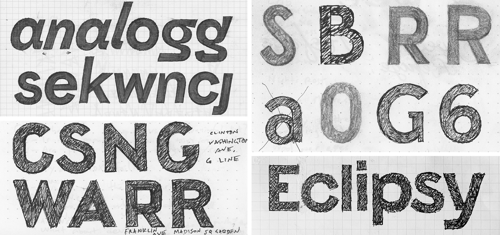
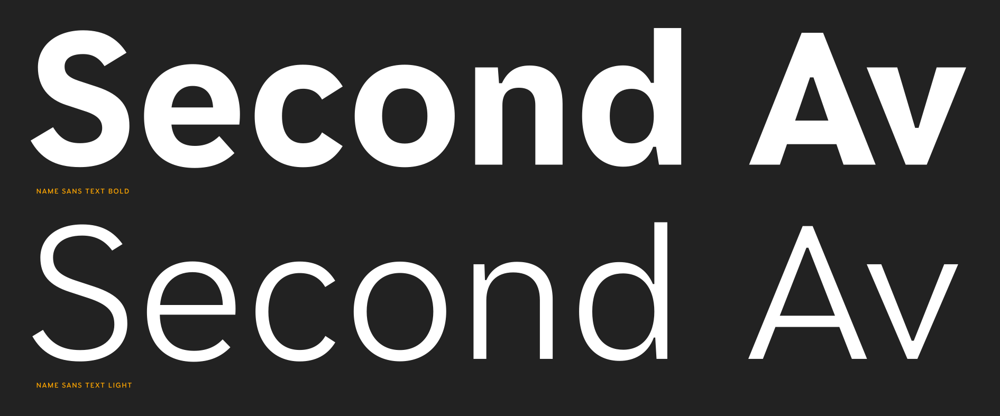
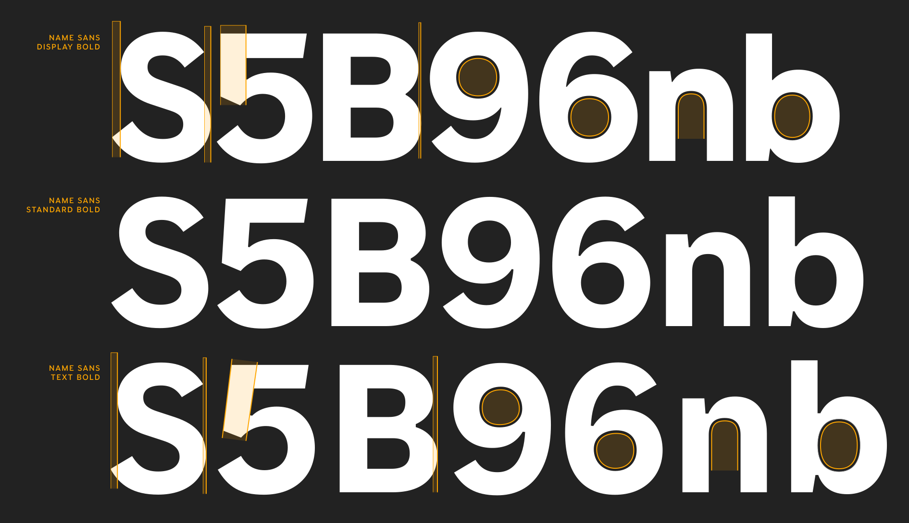
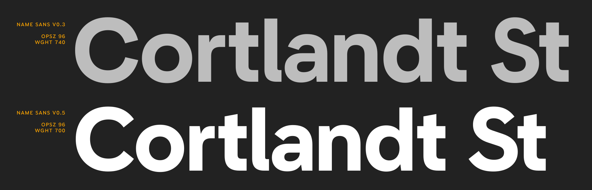
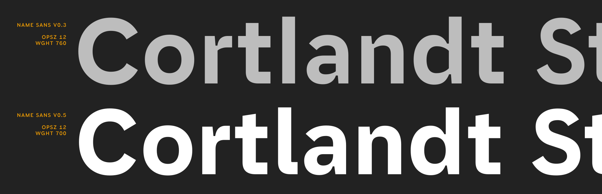
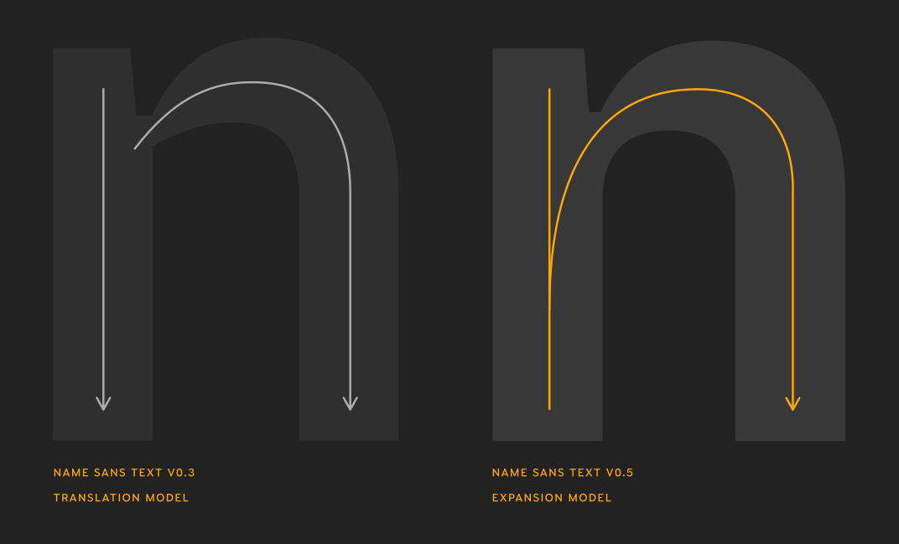

[Name Sans](https://name.arrowtype.com) is a modern interpretation of the mosaic name tablets of the NYC Subway. It is currently available with discounted pre-release pricing [via Future Fonts](https://www.futurefonts.xyz/arrowtype/name-sans).

From an outsider’s perspective, it might seem pointless to see a new release of “yet another geometric sans.” At a quick glance, it might look like Name Sans is basically just *[insert your favorite sans-serif font name here]*. Admittedly, there is some truth to this. Name Sans doesn’t have characters you can’t already typeset in existing fonts – it’s ultimately just a slightly-different way of approaching the same old [Latin script](https://en.wikipedia.org/wiki/Latin_script).

But, just as it’s nice to have new music, new fashion, and new architecture in the world, new typefaces like Name Sans are about creative expression, pushing boundaries, engaging with history, and – at risk of sounding poetic – communicating something about the human experience. This article is here to point out some of the thinking and process behind Name Sans, what it can do that is different from other typefaces, and some of the details that make it unique.

## What is Name Sans, anyway?

My favorite fonts are usually released along with an introductory article. Name Sans is still an active work-in-progress, now in its fifth pre-release version. In a way, you can think of this as the “v0.5” blog post introducing Name Sans, its process, and its design – I plan to revise this post when I can finally release version `1.0`.

For me as a type designer, it isn’t always (if ever?) obvious what a project should be from the outset. Releasing Name Sans progressively through Future Fonts has helped me find what it really needs to be as a typeface. Certainly, my understanding of it has evolved since the earliest versions. Spending time with it myself – and especially seeing it in use by other designers – has helped push my thinking forward.

So what *is* Name Sans, really?

Well, one answer is that it’s the font you’re reading right now – but it’s also much more than that. Another simple answer is that it’s a 36-style font family with variable axes for Weight and Optical Sizing. But it’s also more than **that.**

<figure class="main-col">
  
  <figcaption>Styles of Name Sans v0.5</figcaption>
</figure>

As the tag line says, Name Sans is *a modern interpretation of the mosaic name tablets of the NYC Subway.* 

Mosaic **name tablets** are by far my favorite feature of the Subway. These pieces of lettering built from ceramic tiles declare station names for Subway riders, while smaller versions provide extra wayfinding help within stations. Making this source of inspiration into a typeface is a project I have been imagining and sketching since moving to NYC in 2014, then more actively developing as a font family since the end of 2019.

<figure>
  
  <figcaption>
  Name Sans seeks to capture my favorite aspects of the varied mosaic signage of the NYC Subway system.
  </figcaption>
</figure>

When I first had the idea for this project, I expected that I could dig up some kind of perfect blueprint for the mosaic signage from which to make a type revival. I have since seen a few tantalizing examples of historical documents that are *close* to what I’d like – but direct architectural plans have so far eluded me. So, the drawings for Name Sans are not a direct copy of scans from a dusty old type specimen. Rather, they are the product of me experiencing and appreciating the Subway mosaics over time, taking countless photos, and sketching ideas while riding the train.

<figure>
  
  <figcaption>
  As an NYC commuter, I almost always keep a sketchbook in my bag. When I can snag a seat, I try to draw letters. The rattling of the train is more apparent in some sketches than others, depending on my patience on any given day.
  </figcaption>
</figure>

At one point, several years ago, I mentioned to an experienced type designer that I was thinking of making a typeface that would be a revival of the Subway mosaics. “Impossible!” they said, “what would you even revive?” At first, I was taken aback. How dare they doubt me like that! I wanted to prove them wrong. With time, I have come to understand what they meant.

Name Sans isn’t a *revival*, and it couldn’t be a revival.

Type revivals are recreations of specific fonts previously made with obsolescent technology, as when a digital font is made to recreate letters originally cast in metal for letterpress printing. There was no single, consistent “off-the-shelf” font used for the Subway mosaics. The system was built by [several separate companies over many decades](https://en.wikipedia.org/wiki/New_York_City_Subway#History), with projects led by different architects over time. The subway mosaics are a loose system of architectural lettering – not a singular typeface that one could “revive.”

So, this project is perhaps as much historical fiction as it is historical research. I am creating a type family based on what I have observed in actual mosaics and adapting this into a typeface that is useful, flexible, and built for this decade. Partly, though, I am making the typeface that I imagine could have been there the whole time, if perhaps [Heins & LaFarge](https://en.wikipedia.org/wiki/Heins_%26_LaFarge) had commissioned a custom typeface for NYC’s first Subway from a type designer who time-traveled back a century.

In many ways, *not* having a single point of reference has freed me to make this project what it needs to be: a typeface that respects the past but doesn’t get stuck in it. There are clearly repeated lettering styles for different train lines and different eras. But also, something I love about the Subway is that there is not a perfectly repeated system for the name tablets. If all of the wayfinding was purely set in Helvetica and stations had a completely uniform aesthetic, the Subway would be painfully boring. More practically, it would also simply be harder to know when you reached the right station. As a rider of the NYC Subway, you learn to identify your stop by the color of tiles and the big lettering on the station walls. If you always had to look closely for Helvetica on uniformly–gray walls, you would end up missing stops a lot more often.

Name Sans picks up on my favorite aspects of the Subway wayfinding system and brings them together into an extended Latin character set with a wide range of weights and optical sizes. If I had gotten stuck on finding just one thing to revive, I wouldn’t have had the flexibility to really explore what is useful in a geometric-grotesque sans – and what is newly possible with type technology today.

<figure>
  
  <figcaption>
    The “Equitable Building” mosaic at Wall St is one of my favorite signs in all of NYC. Note the circularity, unusual proportions, and the sharp spur of the G. Even though I love specific mosaics, there are too many divergent styles to represent in a single typeface – so Name Sans brings in the best features from signs across the NYC Subway system.
  </figcaption>
</figure>

Even if I *had* found blueprints, this project would have required creativity and adaptation. For one thing, the mosaics only contain the basic English uppercase alphabet, plus numbers and a few extra symbols like arrows and ampersands. I was always going to have to invent the lowercase, extended Latin alphabet, accents, and symbol set.

Beyond that, the mosaics only have a narrow range of weights – roughly “Regular” to “SemiBold” – and only have a sign-specific range of sizes – large to huge, meant to be seen from a distance. A typeface must offer a broader typographic palette unless if it is only intended for very specific usage. This suggested the need for an extended weight range. Type must be made for particular scales and contexts to work well. For Name Sans, that meant designing to target the small-to-large settings common to modern print & digital needs – often in longer strings than single Subway station names. I wanted Name Sans to deliver the punch of the mosaics effectively across font sizes, which suggested the need for a range of Optical Sizes (more on this below).

Working from more than a single specimen has also revealed possibilities beyond size & weight ranges. A challenging aspect of the project has been deciding which forms of letters to borrow from the system, as there are often multiple possibilities. For example, round uppercase letters can be found both with circular forms and with flat-sided forms, depending which station and sign you reference. Rather than drawing only the most common style of an uppercase, I have made two – a default set with the circular forms, plus a stylistic set (`ss01`) that takes on flat-sided, rectangular shaping. Another question was which `R` to use – the more common, basic construction with a straight leg, or the uniquely mosaic approach to a grotesque `R` with a monolinear leg “kick”? Well, it’s a modern typeface, so again, I could include both using Stylistic Sets. And then, it’s a modern typeface, so why not add a few other things fit that users might want, like a single-story `a`?

And thus, I have sought to build a typeface that captures the best energy and spirit of the Subway mosaics but which is genuinely useful to designers working in digital systems, wayfinding, and graphic design.

**Side note:** if any transit archivists or aficionados are reading this and know of specific blueprints or specifications that I might have missed, I’d be super appreciative to learn more! The online archives are great but (understandably) don’t contain images for every possible item. A 2019 exhibit did include a few beautiful watercolors and pencil sketches, but not as many as I had hoped for. I haven’t yet been able to dig further into physical archives due to COVID-19 protocols, but I would very much like to see more! You can reach me at `info@arrowtype.com` if you want to chat.

The following will go into more detail to describe the formal qualities that exist in the Name Sans design.

## A wide range of Weights & Optical Sizes

Name Sans includes two axes of stylistic variation: Weight and Optical Size.

### Weight

It’s relatively self-evident what it means for a typeface to offer a range of weights. If a font has just one weight, it will be limited in how it can be used and will almost always need to be supported with other fonts. But, if a typeface offers even just two or three weights, it dramatically opens up what you can use it for. These benefits continue to increase with further range and granularity.

<figure>
  
  <figcaption>
    Name Sans has a weight range that is as wide as (reasonably) possible, offering both workhorse core weights and high-impact extremes in one easy-to-use system.
  </figcaption>
</figure>

Many designers would reasonably contend that there is a point of diminishing returns. Once you have styles that are light enough and bold enough, along with a few between, you don’t really need more. There may also be a paradox of choice for users: if a typeface has too many options, it might become hard to pick the ones you want. These are valid concerns. From a creator’s perspective, too, it is essential to draw lines of scope so you can provide adequate focus to the work that falls within that scope.

For Name Sans, I *have* of course drawn lines of my project scoping – but I have also made a concerted effort to push those lines beyond what a typical project may impose. In my experience as a designer, there are always times when I wish a typeface would go *just a little bit bolder* or *just a little bit lighter*. A goal of Name Sans is to provide the most utility and versatility to as many designers as possible. So, just as a designer may select a computer with plenty of “headroom” in its RAM and storage – even if they may not use those full limits most of the time – there is value if a typeface can do more than most people need, on average.

<!-- SVG to allow css variable -->
<svg class="main-col" xmlns="http://www.w3.org/2000/svg" viewBox="0 0 1839 1761">
  <g fill="none" fill-rule="evenodd" transform="translate(35.177 .155)">
    <path fill="hsla(0deg, 0%, 50%, 50%)" d="M537.676646,1752.66536 C773.612368,1752.66536 922.877825,1686.86016 1022.38813,1548.82974 L1035.22817,1548.82974 L1075.35329,1728.59029 L1768.71541,1728.59029 L1768.71541,831.392545 C1768.71541,272.850835 1470.1845,-6.82121026e-13 911.64279,-6.82121026e-13 C487.921493,-6.82121026e-13 186.18057,194.205594 56.1751719,515.206577 L706.202162,717.437196 C731.88224,650.02699 775.217373,611.506872 849.047599,611.506872 C927.692839,611.506872 974.237982,659.657019 974.237982,743.117275 L974.237982,754.352309 L617.926891,754.352309 C215.070658,754.352309 -7.95807864e-13,953.372918 -7.95807864e-13,1259.92886 C-7.95807864e-13,1563.27478 218.280668,1752.66536 537.676646,1752.66536 Z M861.887638,1240.6688 C797.687442,1240.6688 768.797353,1208.5687 768.797353,1158.81355 C768.797353,1110.6634 805.712466,1076.9583 861.887638,1076.9583 L974.237982,1076.9583 L974.237982,1115.47841 C974.237982,1200.54367 930.902849,1240.6688 861.887638,1240.6688 Z" opacity=".26"/>
    <path stroke="#9F9F9F" stroke-width="2" d="M899.993496,45.9401376 C1136.77279,45.9401376 1314.89071,110.454114 1434.49056,231.655746 C1555.73202,354.520973 1616.80798,535.602773 1618.01737,766.597265 L1618.0357,773.612368 L1618.0357,1727.59029 L1236.30682,1727.59029 L1205.81172,1514.12464 L1191.54526,1514.12464 C1089.02726,1681.09697 920.658411,1754.87537 691.342857,1754.87537 C519.119491,1754.87537 379.017056,1704.91248 281.726274,1616.76869 C183.539528,1527.81318 128.986133,1399.98208 128.986133,1245.48381 C128.986133,1089.16222 185.312866,961.203038 288.632577,872.643286 C389.716812,785.999655 535.745472,737.076743 717.911714,736.106949 L723.442955,736.09225 L1154.58427,736.09225 L1154.58427,690.152112 C1154.58427,614.000026 1130.83909,552.429781 1084.48309,510.262576 C1039.61807,469.451623 973.535397,446.796371 887.153456,446.796371 C740.982203,446.796371 637.162903,512.679198 558.670127,621.237838 L556.299293,624.540533 L227.293676,380.181992 C379.598248,177.046019 611.816289,45.9401376 899.993496,45.9401376 Z M1154.58427,1061.51325 L786.038147,1061.51325 L784.097692,1061.51767 C720.208548,1061.80936 670.76377,1076.52845 637.067249,1103.48567 C602.466347,1131.16639 584.412533,1171.7544 584.412533,1223.01374 C584.412533,1275.6828 602.325326,1316.95085 636.449567,1345.02079 C670.294695,1372.86114 720.142032,1387.72424 784.433142,1387.72424 C895.503196,1387.72424 988.038854,1355.89213 1052.80161,1300.13984 C1117.5649,1244.3871 1154.58427,1164.70929 1154.58427,1068.93327 L1154.58427,1068.93327 L1154.58427,1061.51325 Z"/>
    <path stroke="#9F9F9F" stroke-width="2" d="M921.979168,88.7991389 C1132.62168,88.7991389 1295.46021,150.81943 1405.92995,266.691109 C1516.50136,382.66943 1574.58464,552.560861 1575.73525,768.047086 L1575.75268,774.59092 L1575.75268,1727.73521 L1358.37175,1727.73521 L1342.36262,1449.17631 L1332.8021,1449.17631 C1280.81478,1550.94678 1207.71793,1628.70637 1109.70624,1680.54726 C1014.96693,1730.65731 896.963648,1756.55165 752.282364,1756.55165 C579.900293,1756.55165 440.177005,1709.95962 343.4906,1626.25682 C246.597963,1542.37547 192.96273,1421.23266 192.96273,1272.47494 C192.96273,1121.03509 249.212979,998.520489 352.483444,914.026473 C454.136187,830.856047 601.303802,784.527654 785.1228,783.609403 L790.704282,783.595486 L1312.00109,783.595486 L1312.00109,737.769915 C1312.00109,610.526259 1275.99543,508.766022 1208.93112,438.941868 C1142.34439,369.614943 1045.11861,331.738865 921.979168,331.738865 C739.719541,331.738865 612.257421,410.021385 511.759691,549.599997 L508.72253,553.848396 L310.191308,404.552917 C450.877126,197.22827 660.119448,88.7991389 921.979168,88.7991389 Z M1312.00109,996.11786 L811.516154,996.11786 L808.076107,996.12525 C694.802512,996.612819 606.088765,1021.21534 545.351422,1066.026 C483.227813,1111.85942 450.310675,1178.82875 450.310675,1262.86946 C450.310675,1349.51675 483.167479,1418.12972 543.640327,1465.13361 C604.2266,1512.22567 692.586986,1537.62562 803.511588,1537.62562 C958.287005,1537.62562 1085.38011,1490.68618 1173.79367,1407.29295 C1262.23751,1323.87116 1312.00109,1203.95604 1312.00109,1057.95256 L1312.00109,1057.95256 L1312.00109,996.11786 Z"/>
    <path fill="var(--namesans-accent)" d="M815.372225,1760.69039 C1203.78341,1760.69039 1462.18921,1521.54466 1491.07929,1134.73847 L1491.07929,1728.59029 L1494.2893,1728.59029 L1494.2893,762.377333 C1494.2893,367.546125 1284.03366,134.820413 926.117564,134.820413 C686.971832,134.820413 495.976248,231.120707 372.39087,436.561336 L375.600879,438.166341 C499.186258,234.330717 688.576837,138.030422 926.117564,138.030422 C1282.42865,138.030422 1491.07929,369.15113 1491.07929,762.377333 L1491.07929,839.417569 L841.052304,839.417569 C459.061135,839.417569 240.780467,1003.12807 240.780467,1288.81894 C240.780467,1584.13985 457.45613,1760.69039 815.372225,1760.69039 Z M815.372225,1757.48038 C459.061135,1757.48038 243.990477,1580.92984 243.990477,1288.81894 C243.990477,1006.33808 460.66614,842.627579 841.052304,842.627579 L1491.07929,842.627579 L1491.07929,1056.09323 C1491.07929,1484.62954 1229.46349,1757.48038 815.372225,1757.48038 Z"/>
  </g>
</svg>

A technical explanation of my approach for Name Sans: this typeface uses the full possible `1–1000` range for a variable Weight axis, as defined by the [OpenType Specification](https://docs.microsoft.com/en-us/typography/opentype/spec/) (the technical spec which defines the underlying structure of modern digital fonts). The exact amount of thickness these weight numbers should represent are open to interpretation on individual type designers. For Name Sans, I have interpreted `1–1000` to be “as thin and thick as reasonably possible.”

What is reasonably possible, then? To get specific, I am drawing this typeface with a coordinate grid of 2048 units between ascenders and descenders (the `UPM` of the font). The **Display Hairline** style is meant to be a representation of the very core of the characters. It is drawn with stems of just 2 units on this grid – barely enough to allow similar thicknesses in straight, diagonal, and curved strokes. Meanwhile, the **Display Ultra** is drawn to be as thick as possible while still preserving my subjective understanding of the essence of the Name Sans design.

<figure class="main-col">
  <video autoplay loop playsinline muted controls>
    <source src="./namesans-countdown-vid.mp4"
              type="video/mp4">
  </video>
  <figcaption>Weights <code>300</code> to <code>1</code> in Name Sans Display. The Hairline styles offer a near-invisible endpoint for disappearing & appearing animations.</figcaption>
</figure>

A warning: the Hairline is so thin, it disappears in some contexts. Just as designers have to consider how the fill color of type affects its readability, a similar consideration must be given to the weight of type, and often it is better to use a slightly-thicker style, or even to add a bit of an outline stroke to these letters. But, that disappearingly-light weight is a hidden feature: it allows Name Sans to be animated in and out from this core. This can be especially useful in characters that maintain a common width between weights, like tabular numbers (activated with feature `tnum`) and arrows. If any wine label designers are out there, the Hairline characters would also look preeetty nice printed at a large size on a wine label. Just an idea...

### Optical Size

To understand Name Sans, it is essential to first have an idea of what **optical sizing** is. The optical sizes of a typeface are made to preserve its design intent at different sizes. In this way, optical sizes are fairly similar to font weights, which are usually made to preserve the design of a typeface at different relative levels of thickness or density.

<figure>
  
  <figcaption>
    The x-height, contrast, and overall proportions are subtly adjusted along the Optical Size axis to look as good as possible at large sizes while also providing comfortable readability in Text.
  </figcaption>
</figure>

Just as there is no single answer to how every typeface should be designed for different weights, there are many ways to design for different sizes. Generally, though, there are some common strategies:

- Letter spacing usually needs to be more generous for smaller sizes, or letters will look uncomfortably close. Conversely, spacing usually needs to be tighter at larger sizes, or letters may appear to be drifting apart. In fonts with optical sizes, the designer using the font must manually apply set tracking ideal for a given size. In fonts with Optical Size styles (especially variable fonts with an `opsz` axis, like Name Sans Variable) this is taken care of within the font itself.
- Somewhat similar to spacing, kerning can be more “aggressive” in larger sizes, but this will cause problems in text. In Name Sans, the height of lowercase letters is subtly adjusted for larger styles to allow nice, tight kerning in words like “Tokyo” and “Type”.
- Notable visual aspects of a typeface are often emphasized at larger sizes and moderated at smaller sizes. In a high-contrast serif design, this might mean that thin strokes get thinner for larger sizes and thicker to remain visible at smaller sizes. Similarly, in Name Sans, the ends of the weight range are less extreme for smaller sizes – the Text Hairline & Ultra will remain legible at smaller point sizes than their Display counterparts. More specifics are detailed below.
- Some details must be emphasized to hold up at smaller sizes. In a serif design, serifs typically need to be thickened to retain clarity clear in text. In Name Sans, the overall “sharpness” of the design is increased for small sizes, as is exemplified by notches in stems and flat portions of letters (more on this below, as well).

You can start to understand how a typeface handles optical sizing by placing different optical-size styles at the same scale. In Name Sans, this highlights the change of spacing, kerning, proportions, and shaping.

<figure>
  
  <figcaption>
    Letter spacing & kerning is optimized along the Optical Size axis for ideal visual impact & reading ease across sizes.
  </figcaption>
</figure>

Of course, different optical sizes aren’t really meant to be compared at the same scale – or even really with the exact same content. It is generally more accurate to look at different optical sizes in their intended sizes. For Name Sans, Display is designed for 96pt, Standard is designed for 24pt, and Text is designed for 12pt. In practice, type is a little less exact than that, because there are many factors beyond the control of the font size. For example, the distance of the viewer will change [the perceived font size](https://sizecalc.com/), and the exact physical size of fonts isn’t completely standardized across operating systems & apps. So, at the end of the day, even though optical sizing can automatically help designers to achieve more nuanced typography, some amount of contextual judgment will often be important.

<figure class="main-col">
  
  <figcaption>
    Optical Sizes – as their name suggests – are designed to be deliver the same visual intent at different scales. Typically, Display sizes are optimized for short names & phrases, medium sizes (like Name Sans Standard) are optimized for headlines, and Text sizes are optimized for running text.
  </figcaption>
</figure>

Extremes get a lot of focus in the discussion of optical sizing, because they help illustrate design features that might otherwise go unnoticed. However, what happens in the middle is just as important, if not more so. Name Sans **Standard**, then, seeks to roughly correspond to the sizing, spacing, and proportions of common sans-serif typefaces. If you don’t want to think about optical sizes and just want to do typography as usual, this “Standard” option is designed to work well for you. But, I hope you will consider branching out when projects allow for it – your typography will benefit from the added nuance!

**An added note:** because smaller optical sizes require additional letter spacing and have slightly larger lowercase letters, they often result in slightly wider line lengths than display sizes. This is **not** equivalent to a Width axis. If a given space is too small to fit with content set in a Text style (e.g. a long address on a business card template), you are better off making the font size smaller than you would be by changing the optical size to a Standard or Display style.

## Geometry, but with nuance

A striking, prominent trait of the mosaics is that the circular letters are *circles*. In type, a circle never really looks like a circle, but I’ve iterated a lot to get as close as possible to a circular basis for letters like `O`, `C`, `G`, `Q`, `o`, `c`, & `e` – while also keep things looking circular in the context of type.

“Keeping things circular” may sound like a straightforward task – almost too basic for discussion. Just draw some circles, right? Actually, it’s not that simple. In well-made type, seemingly circular letters are never actually just geometric circles. Generally, the letter `O` has to be just a little less wide than tall, and its sides have to be a little thicker than its top and bottom – otherwise, it will look too wide when set in words.  Further complicating things, letters like `C` and `G` can’t just copy the curvature of the `O`, or they will look comparatively wider. You can start to see these differences if you start rotating fonts and looking at them sideways. This is true even in the classics like Futura that designers may think of as “purely geometric.”

<figure class="main-col">
  
  <figcaption>
  You might think of Futura as the prototypical geometric sans, with perfectly circular shapes – but it is actually a good example of how even strictly geometric fonts must include subtle optical compensations to look geometric in practice.
  </figcaption>
</figure>

Of course, geometric type is not meant to **be** geometric – it’s meant to **look** geometric, when in actual use. The way that is achieved will vary from project to project – and like any creative project, the specific solutions will depend on the creator.

If you try to draw a font without compensating for optical issues, it will look bad. Circles will look wide and diamond-shaped, horizontal strokes will appear too thick, and places where strokes join will look overly thick. Correcting for the issues caused by how our eyes perceive type is called optical compensation. It’s an area of type design that is not always intuitive but is essential to engage with when making type.

<figure class="main-col">

  <figcaption>
  If you draw a font from only geometric shapes – with no optical compensations – it tends to look bad. The design of a geometric font is largely the exploration of how much optical compensation is needed to meet a particular goal.
  </figcaption>
</figure>

I could show how you might adapt the above example into a better font with just a few optical corrections ... but this post isn’t really about that. The point is, once you know the problems to avoid, you can start to evaluate fonts by how they individually solve those problems. There are many good geometric sans-serif fonts in the world; Name Sans is my current entry into the field. Of course, I am not *just* trying to make the most-geometrically-strict font with Name Sans. Rather, I have sought to use geometry where it works is attractive but not distracting –  while also making a font that is versatile, bringing in elements of “grotesque” fonts where they can improve goals like visual consistency and readability. 

I doubt it is possible to precisely determine the design goals of the designers of the original Subway mosaics, but my speculation is that they had similar goals: make letters that were geometric, but also natural.

Some fonts prioritize strict geometric shaping, and that can work. But, such typefaces are accepting a trade-off. If a typeface upholds strict geometry over other goals like optical consistency, it will inevitably take on a decorative aesthetic.

One important decision in any geometric font is whether letters like `b`, `d`, `p`, & `q` are drawn with circular bowls. If they are, it can look attractive but also sacrifices versatility. It will always look a little too art-deco or disco to be used for serious communication. Even though I love typefaces like [Avant Garde](https://en.wikipedia.org/wiki/ITC_Avant_Garde), this ultra-geometric style basically always communicates some blend of nostalgia and whimsy. This is fine, but it’s not useful for every project.

Therefore, in Name Sans, I have drawn letters like `b`, `d`, `p`, & `q` to match the visual average width of `n` & `o` rather than to look especially circular. This, in turn, helps to establish a visual rhythm that doesn’t call too much attention to itself.

<figure>
  
  <figcaption>
    In Name Sans Display, letters like <code>b</code> and <code>d</code> are drawn to match the visual average width of <code>n</code> and <code>o</code>, rather than to look perfectly circular.
  </figcaption>
</figure>

Such considerations are also important between different optical sizes. In the Display sizes, the `o` can be very circular, but in Text, the `o` must be made much more similar to the width of `n` to avoid an excessively-wide appearance in running text.

It might be that our eyes are just used to reading certain fonts, and it may be an effect of our eyes rapidly moving horizontally when we read. Either way, anything close to an actual circle will look oblong in running text, so Name Sans accounts for this. Display styles emphasize geometry at a large scale, while Standard & Text styles attempt to look geometric-but-not-distractingly-so.

<figure>
  
  <figcaption>
    In Name Sans Text, the round letters are much closer to the width of <code>n</code>. If they were to keep the circularity of the Display styles, they would look like wide ellipses in running text.
  </figcaption>
</figure>

If you overlay the `o`, `n`, & `b`, you can see quite clearly that while `o` is quite circular, the `n` stays closer to more traditional proportions, and the `b` falls in between.

<figure class="main-col">
  
  <figcaption>
  Comparative proportions of <code>n</code>, <code>b</code>, & <code>o</code> in Name Sans Display
  </figcaption>
</figure>

Even though I want to capture the charm of the Subway mosaics, *charm* is not only achieved through decoration. Instead, I seek to create something which balances geometry and nuance, in order to provide genuine utility for a wide range of applications. So, in Name Sans, the not-quite-circularity is just as critical as the circularity.

## Sharpness

A subtle thing I love about the Subway mosaics: the vertices of diagonal letters usually don’t simply have a one-stroke width. Instead, they tend to be closer to about two-thirds stroke thickness. This gives vertices a sense of sharpness and visually suggests that diagonal letters are made in a single motion, rather than from separate strokes.

Most sans-serifs take one extreme or the other on their treatment of vertices. Broadly speaking, they either take the Futura route with pencil-sharp points or the Helvetica route of prioritizing evenness of strokes, proportions, and color without really considering vertices. I like that the mosaics take a practical, in-between approach: they have vertices that are slightly sharp and a little bit blunt. Naturally, I have sought to preserve this in Name Sans.

<figure>
  
  <figcaption>
    The sharpness of diagonal letters varies between eras of Subway mosaics, but the “endcaps” of vertices tend to be around two-thirds of the main stroke thickness.
  </figcaption>
</figure>

<figure>
  
  <figcaption>
    Even smaller-scale mosaic signs were made with care. Most of these include partially sharp vertices on diagonal letters that closely match the look of their larger-scale relatives.
  </figcaption>
</figure>

<figure>
  
  <figcaption>
    The bluntly sharp vertices from the Subway mosaics are carried into Name Sans.
  </figcaption>
</figure>

Sharpened vertices come from a slightly different logical basis than many sans-serifs. Rather than suggesting diagonal letters are made from separate diagonal strokes and attempting to perfectly balance the volume of interior spaces – as a signpainter might create them – these paths are suggestive of the way a person with a pencil might write such characters in a single path. They prize repeated interior volumes a little less and show the letters as “single units” a little more.

<figure>
  
  <figcaption>
    The sharp vertices give the impression of letters that are “written” in a single stroke, rather than constructed from multiple lines.
  </figcaption>
</figure>

I have extended this quality of sharpness to the meeting points of lowercase letters like `a`, `g`, `n`, `m`, `b`, `d`, `p`, & `q`. Rather than trying to suggest a single, monolinear vertical stem on these letters, I have borrowed the idea of sharpness to give a little more whitespace to these corners while also avoiding the need to add to much contrast to the strokes connecting bowls. Would the original architects have done it this way? It’s hard to say – possibly not. But, this approach allows the typeface to work together in a way that maintains a sense of sharpness while also remaining a cohesive sense of each letter being a self-contained unit that works smoothly with its neighbors.

Like every aspect of Name Sans, this approach to sharpness is adapted across optical sizes to be ideal at large, medium, and small sizes. As the `opsz` decreases, the stem sharpness is dialed up to preserve this visual feature.

<figure>
  
  <figcaption>The lowercase letters borrow the sharp spur from <code>G</code> to carry a sense of sharpness across the typeface. Like most features of the family, this is adjusted between Optical Sizes.</figcaption>
</figure>

It’s difficult to put into academic terms, but this slight sharpening of stems also gives me a certain **feeling** of the sharp edges and slight imperfections of the ceramic tiles used in mosaics – even when (or especially when) it’s used for running text.

<figure>

<figcaption>The contstruction of Name Sans delivers a visual texture that captures the unique mixture of sharpness and warmth of mosaic tile signage.</figcaption>
</figure>

## Optical compensations both exaggerated and (almost) ignored

There is so much that could be included when describing the personality of the Subway mosaics – and many divergent examples that could be highlighted. I suspect that any given type designer might pick up on something different.

<figure>

<figcaption>Mosaic name tablet 2nd Ave – note the vertically-symmetrical B, circular O, short-armed E, and prominent “kick” on the leg of the R</figcaption>
</figure>

<figure>

<figcaption>Mosaic name tablet at 96th St – note the circular, symmetrical counters in 9 & 6</figcaption>
</figure>

For me, though, a core aspect of the personality in the mosaic lettering is the way the optical compensations are handled – beyond just how circles look.

In type, optical compensations tend to follow predictable patterns (at least once you know what to look for). Horizontal strokes are a little thinner than vertical strokes. Joining strokes are narrowed to avoid looking too thick. The bottom “halves” of certain letters are a little bigger than the tops. As mentioned above, “circles” are never really circles. There are these and many, many more techniques that you discover while drawing type.

The mosaic letters often either completely exaggerate or completely disregard conventional rules. The tiles don’t tend to modulate thickness between vertical and horizontal strokes because they are (more or less) square. But also, visually symmetry is handled in unusual ways. For example, the `S` tends to exaggerate its form by being much wider on the bottom than at the top, while the `B` sometimes contrasts this with two bowls that completely match in size. The `E` has a middle bar that is super-short, while the `5` forgoes a typical slanted top-left.

These quirks are some of what make the mosaics so endearing to me. In the context of mosaics, the lettering can get away with a lot of liberties that might look bad elsewhere.

In Name Sans, I’ve had to moderate some of the extreme quirks of the mosaics to make sense in a digital typeface. But, especially in the Display styles, I’ve preserved a lot of the unconventional traits. I’ve kept vertical and horizontal strokes as nearly-monolinear as they can be without looking “reversed.” I’ve kept a taper in the proportions of `S`. I’ve kept the `B` almost vertically-symmetrical. I’ve kept a short mid bar on the `E`. I’ve kept an upright `5`. I’ve kept certain whitespaces, like the counter of the `n`, perfectly symmetrical – except in the lightest styles, where this starts to look asymmetrical. For every visual quirk in Name Sans, there are mosaic letters that led me to make that decision.

<figure>
  
  <figcaption>
    Name Sans plays with symmetry and asymmetry in proportions and counter spaces. Larger sizes emphasize visual quirks in proportion, symmetry, and rigidity of the Subway mosaics. Smaller sizes adapt many of these mannerisms into more typical shaping.
  </figcaption>
</figure>

The Subway mosaics can get away flaunting convention because they are large and seldom include very much content. In making Name Sans, I have found that the larger optical sizes can come close to matching that uncompromising approach.

Meanwhile, many of the optical conventions bucked by Name Sans Display are normalized a little bit in smaller optical sizes: horizontal strokes get a bit thinner, the `S` and `B` become a bit more traditionally balanced, the `5` gets a bit of a slant, and so on. This makes Text styles a little more familiar to read, while still keeping things lively.

## A blend of rigidity & fluidity

Often, the most striking feature of the Subway mosaics is how they seem to defy the physical limitations you might expect of rectangular tiles. The way that letters will gracefully, fluidly curve shows that the mosaic letterers were occassionally just showing off. This is even more striking in the serif styles of lettering and in other signage sprinkled throughout the system, but that is a topic for another project.

<figure>
  
  <figcaption>
  A smaller directional sign at an exit from the Barclays Center station, for a church that unfortunately was <a href="https://forgotten-ny.com/2016/06/rip-church-redeemer-downtown-brooklyn/">demolished in 2016</a>. This sign isn’t really a part of my current project, but it is a pretty awesome example of what a skilled mosaic artist can do with letters and tiles.
  </figcaption>
</figure>

But also, there are plenty of moments where the grid of tiles is embraced. The rectangularity of tiles influences the letters they form. As you can imagine, the dimensions of tiles often dictate the thickness of letters and the placement of cross-strokes. An even more-obvious obvious example of following the grid is found in flat-sided round letters. In a broader sense, though, the exclusive use of uppercase letters is also an example of the grid of tiles influencing the forms designed. Uppercase letters simply don’t require as many complex curves and details as lowercase letters.

<figure>
  
  <figcaption>
  Bottom-heavy <code>S</code> shaping and a leg-kicking, grotesque <code>R</code> at Spring St.
  </figcaption>
</figure>

<figure>
  
  <figcaption>
  A compact, flat-sided <code>O</code> matched to otherwise (mostly) normal characters at Fulton St.
  </figcaption>
</figure>

Without direct examples, I have had to invent a lowercase for Name Sans. In part, I have done so by looking for examples of similar styles of letters in sources from a roughly similar time as early Subway stations. One particular source of inspiration is the 1912 catalogue of the American Type Founders. This includes several “gothic” (AKA grotesque) typefaces which, although clearly not the model used for the Subway mosaics, do share some similar ideas. Aside from similar overall letterforms, strict geometry, and low-contrast strokes, some of these gothics include flat portions of letters. These flat portions are placed where curves would normally be “shallow” or used as optical corrections, like the top of the `f` & `r` and bottom of the `t` & `y`.

<figure>
  
  <figcaption>
  Inland Gothic No. 8, from the American Type Founders 1912 Specimen Book of Type Styles. Includes flattened portions of <code>g</code>, <code>t</code>, <code>r</code>, <code>j</code>, and <code>y</code>.
  </figcaption>
</figure>

<figure>
  
  <figcaption>
  Times Gothic, from the American Type Founders 1912 Specimen Book of Type Styles. Includes smooth counter connections and pairs circular round characters with others with are more compact.
  </figcaption>
</figure>

These flat portions or lowercase gothic letters remind me of the flat-sided letters used in some of the Subway mosaics. Seeing them makes me think of how one might realisticaly approach shallow curves in tile mosaics. In Name Sans, I have embraced flat portions of letters, juxtaposing these against other moments of fluidity, geometry, and sharpness. I see this as following the example of the original mosaic lettering. Am I also influenced by ideas from the 100+ years since the first Subway mosaics? This is inevitable in any historical fiction. But, I also suspect that what I’m designing might be fairly unsurprising to a mosaic artist from a century ago.

<figure>

  <figcaption>
  Flat portions of Name Sans echo the rigid shaping of Inland Gothic No. 8, and suggest the grid-oriented physical construction of Subway mosaics.
  </figcaption>
</figure>

To an extent, I must admit, the decision to incorporate flat segments was also influenced by certain instances of vinyl Helvetica station signage. I find it endearing that the `S` has a flat segment in its spine, and that the `t` sometimes ends in a horizontal tail, rather than its more-typical little upturn. I can’t deny that Name Sans has modern influences – another reason it is an interpretation rather than a revival.

<figure>
  
  <figcaption>
  Stylistic Set 1 references the rigidity found in mosaics lettering with flat-sided caps.
  </figcaption>
</figure>

## “Obviousness” and evolution

What is “simplicity”? It’s a much-debated question, but – at least when it comes to type – is somewhere between impossible and counterproductive. Is “simplicity” an absolute minimum of shaping detail? Partially yes – but if taken too far, that definition might lead to letterforms without necessary optical compensations, which looks terrible in practice. Is “simplicity” repeating what we are already used to seeing and reading? Partially yes – but if taken too far, that definition would conclude that we already have exactly the type we need and would forgo the possibility of ever making things better than what we already have. 

What is “obviousness”? That is a more straightforward question. It assumes an individual perspective, unlike notions of simplicity, which often seek to impose a universal, dogmatic view. What is obvious to one person is not necessarily obvious to another. More importantly, what is obvious is dependent on a given project & context. In designing Name Sans, I have tried to make decisions according to what the obvious, elemental forms of letters are – while also keeping in mind my experience and understanding of the Subway mosaics.

A primary example: the terminal angles and aperture tightness of sans-serif letters have a big impact on the tone of a typeface. What is the most obvious way to handle this aspect of a design? What would be obvious within the mosaics?

In early versions of Name Sans, the apertures of letters like `C`, `S`, & `a` were very “closed” in Display styles, and much more “open” in Text styles. The logic was that, with tighter spacing in the Display styles, tighter apertures kept letters more self-contained. But, as I contended with coming up with an explanation rooted in actual examples from Subway mosaics, I had to admit that this solution was too much of an invention of my own. I was too closely following type trends of the last few years – these tight apertures were hardly something that would be obvious to the folks making signs many decades ago. 

So, I adjusted my terminals to be at a more obvious placement and angle. I prioritized what would make strokes appear to end with square terminals at a roughly 45° placement – using my eyeballs rather than an actual measurement. This small adjustment made the characters in Name Sans much more similar to the overall appearance of Subway mosaics.

*In earlier versions of Name Sans, opening shapes of many characters were tight, in response to other popular & historical grotesque typefaces. They have since been widened to more closely reflect observed lettering of the NYC mosaics.*

There are a few exceptions to the open apertures. The Black & Ultra weights, which are pretty unabashedly of my own invention, exagerate the system into purely-display territory. Here, the apertures do close off to avoid overly-large whitespaces in text. Likewise, some tabular figures are fairly wide across all weights, so numbers like `2` and `3` have more-horizontal terminals in their tabular versions.

*Apertures were opened up – but only a bit – in Ultra weights. Counters were adjusted from circular to elliptical shaping to present of more-serious tone.*

An example, though with slightly different logic, is the way lowercase are constructed. These have joints that have smooth rather than sharp connections. Because the lowercase had to be invented from a relatively-sparse set of examples, one of the bigger decisions of the project was whether to connect bowls to stems with a smooth connection, as in “neo-grotesque” fonts like Helvetica, or whether to connect these with sharp connections, more in line with more “humanist” gothic fonts like Franklin Gothic.

Uppercase letters don’t have that many opportunities to show this decision. The `G` does have such a joint in some forms, but on the whole there are few connections that relate to the more “handwritten” logical basis for the Latin lowercase. However, numbers offer a few more opportunities for insight into what might be natural for the typeface.

The problem is, there are numbers in Subway mosaics that suggest both strategies. 8th Street uses a number 8 that has a humanist construction – a “single path” in a rotated ∞ shape. Meanwhile, 96th Street has numbers with delightfully-circular counters – more of a grotesque approach. So, while you might expect the mosaic artists to only create shapes that were convenient to lay in tile (presumably, humanist forms without smooth joints), they show time and again that they were interested more in aesthetics than in convenience.

Because these numbers existed as direct examples, I have chosen to follow both potential routes – Name Sans includes a `6` & `9` with circular counters, but bucks the typical geometric-grotesque approach, using a typically humanist form for `8`.

<figure>
  
  <figcaption>
    While many numbers and letters in NYC Subway mosaics fall under shapes that would be categorized as “grotesque,” there are also examples like this <code>8</code> which follow more “humanist” tendencies.
  </figcaption>
</figure>

<figure>

  <figcaption>
    In a nod to the subtle variety of lettering styles in NYC mosaics, the <code>6</code> and <code>9</code> of Name Sans have a “grotesque” structure with smooth counters, while the <code>8</code> has a more typically “humanist” construction, as if written in one smoothly-curving path.
  </figcaption>
</figure>

But again, the lowercase did not have precendents, and therefore, I simply had to choose what looked more obvious in text. I will freely admit that, because I spend hours of every day reading fonts like Helvetica and [Apple SF](https://developer.apple.com/design/human-interface-guidelines/ios/visual-design/typography/), my eyes are biased. It could be that I chose to follow these examples because I found them visually familiar, and knew others would as well.

### Excuse me while I get a little bit theoretical

I do have a theory of *why* smooth-joined lowercase forms have “won out” in so much of today’s typography: with smooth connections, letters feel like *self-contained units*. When it has a smooth connection between its steam and its bowl, a character like `n` is a **single shape** in and of itself, even though it has a complex shape. If, however, an `n` has a sharp connection, it presents itself as **two shapes** connected.

It’s not that I think smooth connections make letters “self-contained” at the *expense* of forming cohesive wordshapes for reading. I still hold the ideal that “A typeface is a beautiful collection of letters, not a collection of beautiful letters.” (Thanks, [Matthew Carter](ted.com/speakers/matthew_carter)!) I am also not disputing the value of a humanist construction for letters. Rather, this is my understanding of why smooth connections help give a font a stable, sturdy presence, while sharp connections tend to present more of an active, forward-moving tone. Both approaches have merits, and both strategies (if executed well) can lead to highly-readable type.

<figure>
  
  <figcaption>
    Earlier versions of Name Sans Text included sharp joints on many characters. These were ultimately smoothed out to better match the aesthetics of Name Sans Display at smaller sizes and to maintain high-quality outlines in intermediate styles.
  </figcaption>
</figure>

The idea of considering letter construction as rooted in physical tools isn’t my own. In reality, the theory is really just my extrapolation of Gerrit Noordzij’s theory of The Stroke. In The Stroke, Noordzij argues that most type can be thought of as originating in the strokes of a writing tool. Noordzij breaks this down into categories which include *expansion* (in which the stroke’s width modulates according to pressure, as explified by a pointed-nib pen) and *translation* (in which the stroke’s width modulates according to a pen’s orientation, as exemplified by writing with a flat-nibbed pen). In expansion writing – the structural basis for typefaces from Didot to Helvetica – the pen makes the core of most letters which a single stroke, traveling down, up, over, and down, allowing for continuous strokes with smooth joins. In translation writing – the structural basis for typefaces from Palatino to Verdana – the pen only travels in a downward or sideways direction, lending to separate strokes with sharp joins. (*Rotation* is another category mentioned. But, as with any model, Stroke Theory is a simplification. The reality of writing is much more complex, and fascinating concepts like single-stroke signpainting and brush calligraphy –  which mix expansion, translation, and rotation – are mostly left out. Still, it provides one useful perspective by which to consider the design of letters.)

<figure class="main-col">
  
  <figcaption>
  Translation vs Expansion models of type, as shown by Name Sans Text in versions 0.3 vs 0.5
  </figcaption>
</figure>

A much more basic explanation is possible, too: sharp connections add extra angles to letters, which add up to more visual complexity on the zoomed-out level of words and text. In the case of Name Sans, it feels best to avoid this type of visual complexity.

(Just in case anyone is reading this and happens to be considering [font defaults for document-creation software](https://www.microsoft.com/en-us/microsoft-365/blog/2021/04/28/beyond-calibri-finding-microsofts-next-default-font/): In the case of a font intended for books or multi-page documents, I would instead lean towards a humanist model. Perhaps this is also because I am used to *that*, but perhaps also because its dynamic presence helps my eyes maintain forward momentum in text when there is truly a lot of it.)

All that is to say: Name Sans might have a smoothly-joined lowercase because this style is perpetually popular and I am crassly chasing after money (I am running a business to sell a product to buyers, after all). But, Name Sans also has a smoothly-joined lowercase because it relates back to the idea that each letter should be a single, self-contained unit, so that the typeface as a whole can have a stable, direct voice. Either way, this is the obvious choice – at least for this project.

## A varied but harmonious set of possibilities

The thing that made this project “impossible” – the diversity of styles and forms in the Subway mosaics – is something I have worked to bring into the project through its range of styles, its nature as a variable font, and its OpenType features.

*Stylistic Sets* are an option that a font can include to allow users to activate various stylistic variants of characters, like (depending on the typeface) a single-story `a` or serif `I`. Stylistic sets can be something of a sore subject to type designers, because these extra features can make a project (sometimes significantly) harder to complete – and then often go totally unknown to the actual users of a font. (This is partly due to their often-terrible UI in design software.) 

Some type designers will even suggest that stylistic sets indicate a lack of decisiveness on the part of a creator, almost to the point of it being a moral failing to include too many of these options. “Pick the best letterform for each character and stick with it,” they advise, “that’s your job as a type designer.”

There is certainly some merit to pushing back on overly-enthusiastic inclusion of stylistic sets and features for the sake of features. But, sometimes, it’s nice to have a tool that can be adapted to the needs of different jobs.

In the case of Name Sans, I would see it as a major missed opportunity to disregard the many, many stations that have rectangular caps for their mosaic signage. So, rectangular caps can be activated with Stylistic Set 1.

I would also see it as a missed opportunity to not bring in my favorite leg-kicking `R` from stations like Spring Street and Bowery. But, I have had to face the fact that an R with a curly leg doesn’t always work, and probably doesn’t work most of the time. It’s often just *too interesting*, to a fault. So, the default `R` of Name Sans has a simple shape with a straight leg, while the cooler “grotesque” form can be activated with Stylistic Set 2.

On top of all that, there are several stylistic sets that are just nice to have in any geometric sans. There is a single-story `a` and a double-story `g`, plus simplified versions of `t`, `j`, and `y`.

<figure class="main-col">
  <video autoplay loop playsinline muted controls>
    <source src="./name_sans-tester.webm"
              type="video/webm">
    <source src="./name_sans-tester.mp4"
              type="video/mp4">
  </video>
  <figcaption>A type tester is available at <a href="https://name.arrowtype.com">name.arrowtype.com</a> to help preview some of the typographic features and stylistic sets of the family.</figcaption>
</figure>

### Size-specific letterforms

In earlier versions of Name Sans, the Optical Size axis automatically switched between forms of characters `R`, `I`, `g`, & `l`, opting for the forms that worked best in most Display vs Text scenarios. This deliberate inconsistency was partly a nod to old grotesque typefaces that included very different letterforms in different “cuts” (literally, different styles of wood or metal cut for different widths and sizes).

In previous versions of Name Sans, there were stylistic sets to turn off this size-specific swapping behavior. In v0.5, however, I have opted to keep a single set of defaults across all sizes – with stylistic sets to turn *on* the automatic swaps.

Why the change? For one, having stylistic sets to turn off behavior got very confusing to coordinate between variable and static fonts – even for me, as the font maker. But also, I had to be honest with myself: if I were a graphic designer using an unfamiliar font, I would probably be confused (and maybe a bit annoyed) if it had a few letters that radically changed shapes at different sizes.

At the same time, as a type-minded designer, I really *like* having a font that changes shape for different sizes. It’s *useful* if small or running text has a more-recognizable `g`. It’s pretty cool if a headline has a wonky `R`. So, for folks who want to use Name Sans in this kind of “expert” mode, Stylistic Sets 19 & 20 will turn on these size-specific substitutions.

<figure>
  
  <figcaption>
    Optional size-specific forms are available in Stylistic Sets 19 & 20 – and automatically activated by Optical Size in Name Sans Variable.
  </figcaption>
</figure>

## Extra quirks worth mentioning

In the mosaics, the `Z` (when it does appear) tends to have a little angle at the bottom right, even though this calligraphic touch isn’t found in any other uppercase letter. I’ve kept this in Name Sans. To carry this trait into the system just a little further, I’ve matched this adapted this angle for the top of the `t`.

In Stylistic Set 1, Rectangular Caps, the `U` has a bottom which is more square than the bottoms of letters like `O` that you’d think might match. Again, this comes from mosaic examples.

In the bolder Display styles, the y has a smooth connection between from its left side down to the descender. This is straight off of Helvetica – even though it’s a bit tricky to incorporate into the family because it must swap to a sharp connection in lighter weights, it looks too nice to leave out.

<figure>

  <figcaption>
    Name Sans sneaks in a few extra quirks from the Subway mosaics, like a calligraphic exit stroke on the <code>Z</code> (echoed by the <code>t</code>) and a flat-bottomed <code>U</code> in Stylistic Set 1. An alternate <code>ß</code>, in an “fz” form borrowed from Berlin street signs, is also available in Stylistic Set 10.
  </figcaption>
</figure>

Simply put, Name Sans is not an accidental design. Every visual aspect of it ties back to mosaics (or occasionally newer) signage in the Subway. I am still learning, and there are still a few decisions that I am turning over in my head and in my sketches, but I am becoming more certain that I have found the right way to balance the many influences of Name Sans into a varied but cohesive type family.

## There’s so much more, but...

Like Name Sans itself, this blog post is only a partially-complete draft. There is so much more I could say about the typeface, the ideas I have tried and abandoned, and the things it can do. Some of these are better outlined in the PDF Specimen and in the slides on Future Fons. But also, I am still in the midst of discovering what Name Sans is! To me, that’s the fun of it.

There are a lot of things I know at this point: I am working on Italics along with a few more typographic features, and I will continue to refine shaping, spacing, and kerning across the project.

(Spoiler alert: the italics will be pretty boring. They *may* have a single-story `a` on by default, but will otherwise be a sloped (and optically corrected) version of the uprights. I am working to keep these as geometric as possible, so they can work seamlessly with the intent of the family as a whole.)

I plan to finish and fully release a `1.0` in the coming months. When I do, I plan to also release a refined version of this essay. 

So, if you managed to actually read (or even skim!) this post and have any questions for me, please let me know.

If you’ve already picked up a license for Name Sans, I really appreciate you coming along for the journey! If you haven’t, it’s still at a greatly reduced price while it’s in pre-release (if you do the math, it’s currently about $4.03 per style). By [purchasing a license through Future Fonts](https://www.futurefonts.xyz/arrowtype/name-sans), you will be securing future updates for free, for life. If you do pick up a license, I hope you reach out to me if you put Name Sans to use! I love to see when people get value out of my type – it makes this whole, slightly ridiculous effort feel worthwhile.

Oh – and finally, please subscribe to my newsletter if you’d like to be alerted when Name Sans 1.0 is released. There just might be another 8,000-word treatise on geometry and historical fiction along with it.