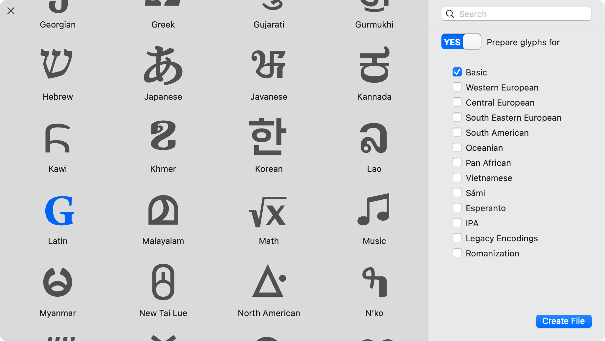
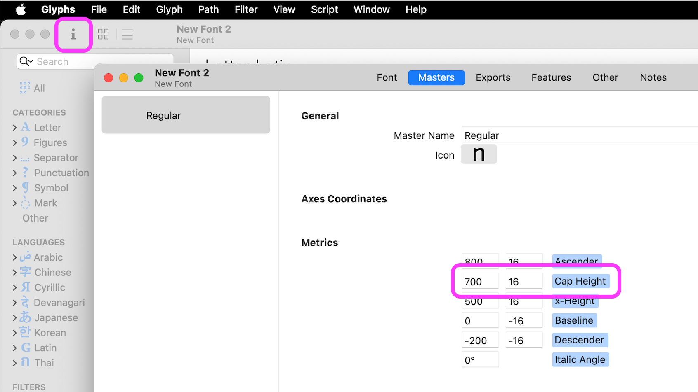
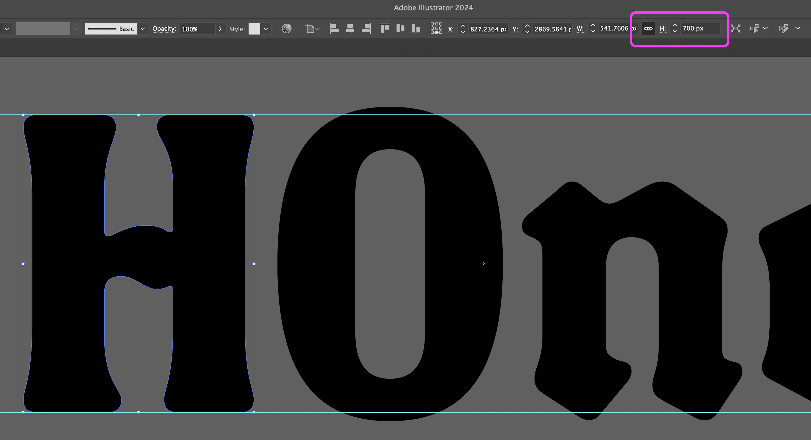
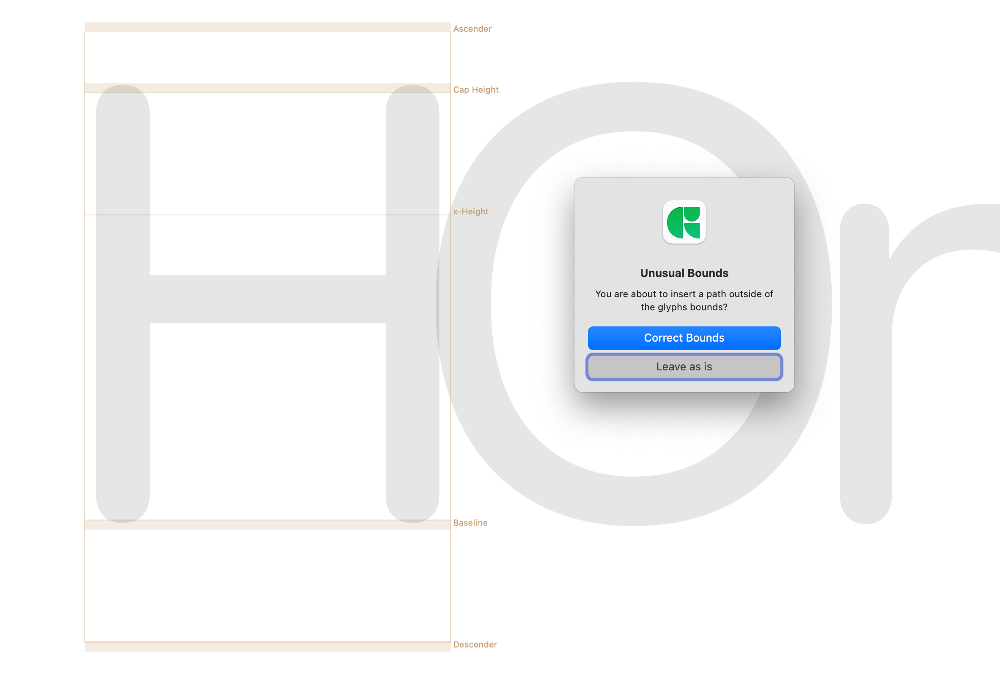
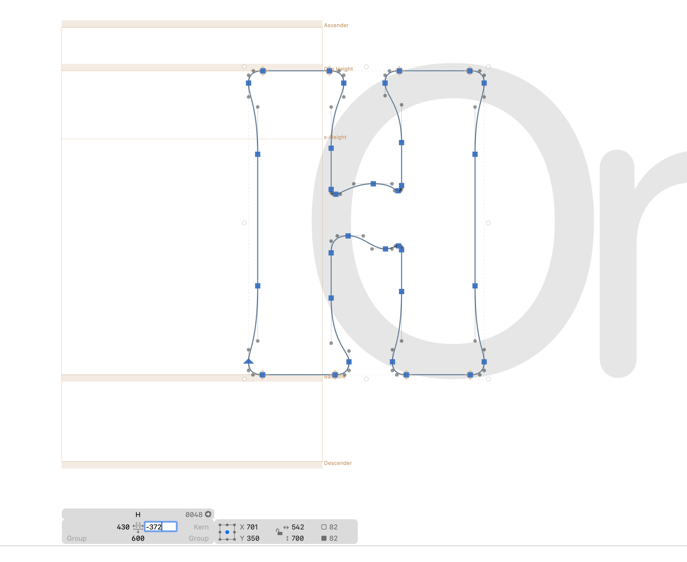
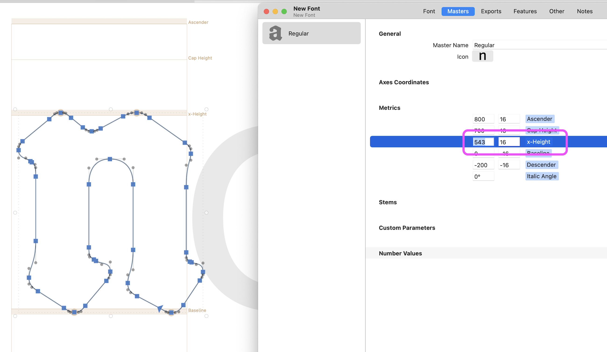

A fairly common question is: “I’ve drawn a font in Adobe Illustrator. How do I make it into a font?”

Back when I made my own first font (about 13 years ago, already!), I remember being surprised that Adobe didn’t just offer a font-making application as part of the Adobe Creative Cloud. They make fonts and they make creative tools, right? Well, more accurately, Adobe makes *money.* Type design is too niche a market for them to focus on providing full software for it. (To be fair, Adobe has made great contributions to the underlying tech of fonts, and Adobe Fonts is pretty well-regarded in the type community!) 

The upshot is: font editing apps are made by a few very small, very cool companies. As you can see from my other blog posts, I am partial to RoboFont and Glyphs.

If you are just starting out, I suggest giving Glyphs a try! If you have *already* started drawing a font in Illustrator, this article may be helpful to you.

Two things to note up-front:
1. If you’ve already drawn a character set in Illustrator, you *can* alternatively use a product called [FontSelf](https://www.fontself.com/), which will allow you to make a font right from Illustrator. I haven’t tried FontSelf, so I can’t comment on how fully featured it may or may not be. If you’re looking for the fastest solution, though, this might be it!
2. If you haven’t yet drawn a bunch of glyphs in Illustrator, I *highly* recommend learning to draw directly in Glyphs, instead. The [drawing tools in Glyphs](https://glyphsapp.com/learn/video-drawing-paths) are about a million times better than those of Illustrator, when it comes to creating letters. Glyphs gives you much more control and (with a bit of practice)is much more efficient and less frustrating for drawing letters.

In either case, [*spacing*](https://ohnotype.co/blog/spacing) is arguably the most important part of making a font. So, if you’re making a font, it’s a great idea to start working within a proper font editor as early as you can.

## How to start your font in Glyphs

First, make a new font in Glyphs. Go to “File \> New from Glyph Sets…” then select “Latin” as the option for a script. Toggle on “Yes” to prepare glyphs for, and start with Basic. You can easily add more glyphs later.

Next, decide on your font’s cap-height. Glyphs gives `700` as a default, and it’s a reasonable default.

In Glyphs, go to “File \> Font Info” (**Command+i**, or click the ‘i’ icon). Then, go to the Masters tab, and check the cap-height.

> 

### A bit more detail on font metrics

The cap-height uses units that are part of the *Units per Em*, or “UPM” of the font. The UPM is the measure of the coordinate grid you will be drawing your font within. You can think of it like graph paper. How precise do you want your grid to be? You can go beyond the bounds of the UPM. A UPM of `1000` is a good default.

If you want, you can also find the cap-height of a most fonts by opening them up in Glyphs. Some fonts have a UPM that is different from 1000, which will change the relative cap-height. 1000 is generally good to stick with, though. If a font you are looking at has a UPM of 2048 and a cap-height of 1432, you can find its cap-height out of 1000 UPM by calculating `capheight / upm * 1000`, or `1432 ÷ 20248 × 1000 = 699.21875` (about 700).

(Also worth noting: the licensing of many fonts will prohibit you from inspecting them like this. So, uh... don’t post about your elite font hacking to social media.)

For what it’s worth, Helvetica Neue has a UPM of 1000, a cap-height of 714, and x-height of 517, so it’s pretty typical to be somewhat close to that. Don’t ask me how I know this. ;)

Script fonts tend to have taller cap-height and lower x-height, but it all depends on the design of a given font. Also, you can scale the font later if needed.

## Copying glyphs from Illustrator into Glyphs

In Illustrator, scale all your drawings so that the overall font matches the cap-height you have chosen. Make sure to scale everything to that size, including round glyphs that may have “overshoot” and lowercase glyphs that won’t go up to the same full height. Scaling glyphs perfectly in Illustrator is a bit of a pain, but the closer you get to perfect here, the easier the next step will be.

> 

One at a time, copy the glyph outline from Illustrator (just select the whole letter, then use **Command+C**), and paste it into GlyphsApp: open up that glyph’s Edit View, then double-click into it, and use **Command+V**. Select “Correct Bounds” if given the option.

> 

With the standard arrow tool (Shortcut: **V**), drag a box around that outline to select it, or use **Command+A** to select all outlines in the current glyph. Slide that outline into place, and adjust the side bearings in the Glyph Info box below (you can turn this on with themenu item “View > Show Info”).

> 

If you need to scale glyph outlines further, you can use the bounding box handles (“View > Show Bounding Box”), or move points.

If the glyph doesn’t look how you expect it to – maybe the interior counter space isn’t showing up as negative space – try using “Path > Correct Path Direction” (**Shift+Command+R**) while you’re editing the glyph.

If you have flat edges at the top/bottom of letters, it’s worth lining these up exactly on the metrics. Glyphs will show a little diamond shape when a node sits perfectly on a metric line. 

When you paste in other letters, you will want to scale your other metrics to fit the x-height, ascenders, and descenders. Helpful to know: you can literally open the Font Info window next to an open lowercase glyph and watch the metric moving as you adjust the number.

> 

## What’s next?

Next up (even before you’ve added more than the first few glyphs!) is to learn how to [adjust spacing](https://glyphsapp.com/learn/spacing) so your glyphs have decent and consistent sidebearings. Pro tip: learn and use the keyboard shortcuts for this!

As you get further along, you can [add more characters to your font from the sidebar](https://glyphsapp.com/learn/adding-glyphs-to-your-font).

Also, if you have new glyphs to draw, it’s worth drawing them directly in Glyphs, rather than going through Illustrator. Here’s [a handy video on how to draw paths in Glyphs](https://glyphsapp.com/learn/video-drawing-paths). This video also offers a bunch of perfect examples of why it’s so powerful to draw letters in a dedicated font editor!

If you want to engage in more passive learning, you can also [check out my YouTube channel](https://www.youtube.com/arrowtype).

Happy drawing!
